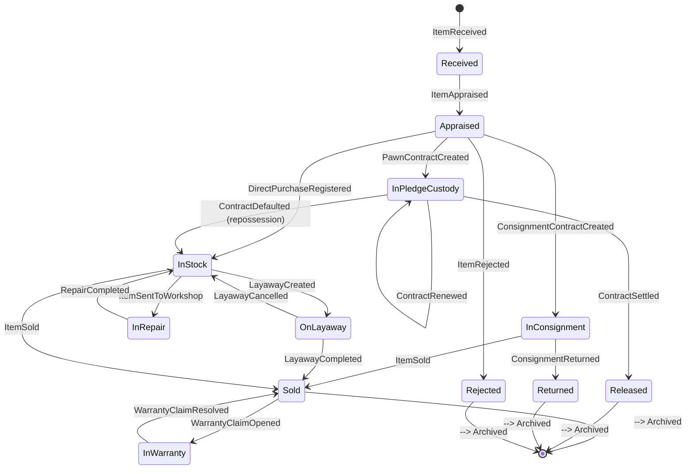
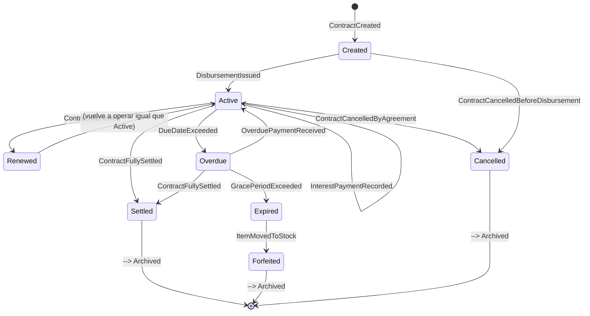
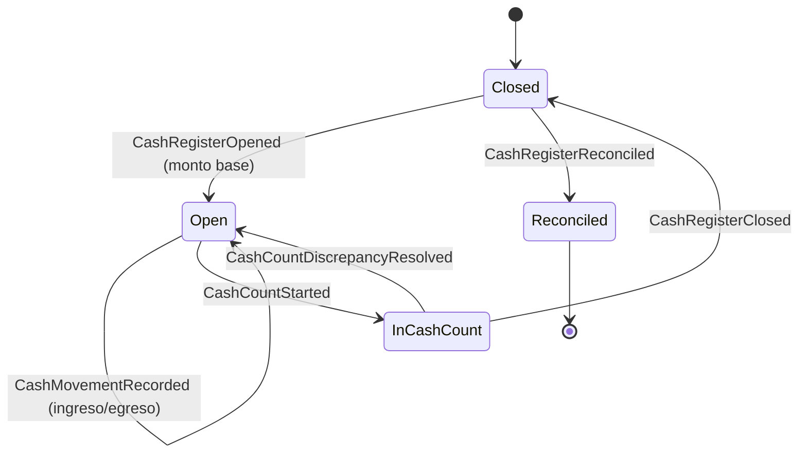
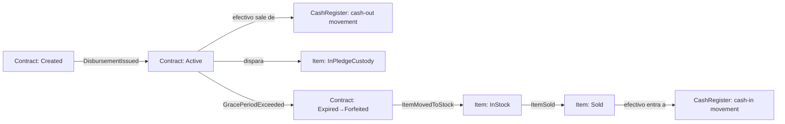

# 02 — Ciclos de vida (máquinas de estado)

> Nota de idioma: la prosa de este documento está en español; los nombres de estados y eventos se dejan en **inglés** porque son los literales que usará el código (enums, nombres de eventos de dominio) — así el diagrama es directamente trazable al código, sin traducción intermedia.

Cada máquina de estado indica: estados, transiciones válidas, y el **evento de dominio** que dispara cada transición (consumido por otros bounded contexts — ver [03-dominios-ddd.md](03-dominios-ddd.md)).

## 2.1 Artículo (`Item`)

El artículo es la entidad central del sistema. Su ciclo de vida varía según la figura de origen (compra, empeño, consignación), por eso el diagrama incluye las bifurcaciones descritas en [01-investigacion-negocio.md](01-investigacion-negocio.md).

**Notas de las transiciones clave:**
- `Appraised → InPledgeCustody / InStock / InConsignment`: la bifurcación depende de la figura de negocio elegida (empeño, compra directa, consignación). Un mismo artículo nunca pasa por más de una de estas tres ramas simultáneamente.
- `InPledgeCustody → InStock` (remate/repossession): solo ocurre tras `ContractDefaulted` y el vencimiento del plazo de gracia contractual. A partir de aquí el artículo se comporta igual que uno de compra directa.
- `InStock → InRepair`: opcional, solo si el módulo Taller (`Workshop`) está activo para el tenant.
- `InStock → OnLayaway`: opcional, solo si el módulo Plan Separe (`Layaway`) está activo.
- `Sold → Archived`: pasa por `InWarranty` solo si la categoría del artículo tiene garantía configurada (ej. electrodomésticos, celulares — no necesariamente joyería).

## 2.2 Contrato (`Contract`)

Se modela una única máquina de estados para los contratos que tienen naturaleza de "compromiso con vencimiento" (empeño, plan separe); los contratos de compra directa y venta son transaccionales (se ejecutan y cierran en el acto, no tienen esta máquina).

**Notas:**
- `Renewed` es un sub-estado operativo de `Active` (mismo comportamiento, distinto contador de renovaciones) — se muestra separado porque dispara reportes distintos (frecuencia de reempeño es un KPI de riesgo).
- El contrato de **Plan Separe** (`Layaway`) usa esta misma máquina reemplazando "interés" por "cuota" (`installment`), y `Forfeited` por `LayawayCancelled` (el bien vuelve a inventario, no se remata).
- `Expired → Forfeited` es la transición donde el contrato deja de ser cartera y el artículo cambia de estado a `InStock` (ver 2.1) — es un punto de sincronización entre los dos agregados vía evento de dominio.

## 2.3 Caja (`CashRegister`)

**Notas:**
- Toda `Open → InCashCount` es de corte diario obligatorio (no se permite mantener una caja abierta indefinidamente entre turnos).
- `CashRegisterClosed` con diferencia no resuelta genera automáticamente un evento de auditoría de alta severidad y bloquea la apertura de la caja del día siguiente hasta revisión (regla de negocio, no una excepción técnica).

## 2.4 Relación entre las tres máquinas

