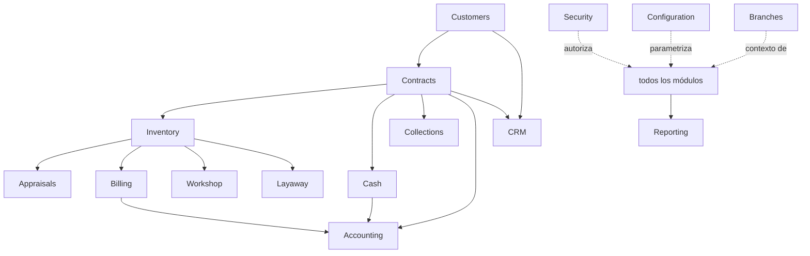

# 03 — Dominios (Domain-Driven Design)

> Nota de idioma: la prosa (objetivo, responsabilidades, casos de uso, reglas de negocio) está en español. Los nombres de bounded context/módulo, aggregate roots, entities, value objects, domain events, repositories y application services están en **inglés** porque son literales de código (nombres de clases, módulos NestJS, tablas). Cada dominio se titula "Nombre en español (NombreModulo en inglés)".

Catálogo de bounded contexts. Cada uno es un módulo independiente y activable por tenant (ver [09-modularidad-configuracion.md](09-modularidad-configuracion.md)). La comunicación entre contextos es por **domain events** — ningún contexto llama directamente a las tablas de otro.

Mapa de contextos y su comunicación principal (nombres de módulo tal como aparecerán en el código):

---

## 1. Seguridad (`Security`)

**Objetivo**: autenticación, autorización y trazabilidad de todo el sistema. Es el único contexto que todos los demás dependen de forma transversal.

- **Responsabilidades**: gestión de usuarios, roles, permisos granulares por dominio/acción/sucursal, MFA, bitácora inmutable de auditoría.
- **Casos de uso**: iniciar sesión con MFA, asignar rol a usuario, revocar acceso, consultar bitácora de un registro específico, forzar cierre de sesión.
- **Aggregate roots**: `User`, `RolePermission`, `AuditLog`.
- **Entities**: `Session`, `AccessAttempt`.
- **Value objects**: `Credentials`, `Permission` (recurso + acción + alcance), `ChangeSnapshot` (valor anterior/nuevo).
- **Domain events**: `UserAuthenticated`, `AccessRevoked`, `PermissionChanged`, `ActionAudited` (se emite automáticamente en cada comando de escritura de cualquier contexto — ver [05-multisucursal-auditoria.md](05-multisucursal-auditoria.md)).
- **Repositories**: `UserRepository`, `AuditLogRepository`.
- **Application services**: `AuthenticationService`, `AuthorizationService`, `AuditService`.
- **Reglas de negocio**: ningún comando de escritura se ejecuta sin verificación de permiso previa; toda escritura genera un registro de auditoría atómico junto con la transacción de negocio (no puede haber una sin la otra).
- **Permisos**: gestionado por sí mismo (meta-permiso: solo Administrador puede modificar roles).
- **Reportes**: accesos por usuario, cambios por registro, intentos fallidos, usuarios inactivos.

---

## 2. Clientes (`Customers`)

**Objetivo**: gestionar la identidad y el historial de las personas y empresas que interactúan con el negocio (como pignorantes, compradores, consignantes o beneficiarios).

- **Responsabilidades**: registro de personas naturales y jurídicas, documentos de identidad, referencias, historial cruzado de operaciones.
- **Casos de uso**: registrar cliente nuevo, verificar identidad, consultar historial completo de un cliente (contratos, compras, ventas), marcar cliente en lista de alerta (riesgo).
- **Aggregate roots**: `Customer` (persona natural o empresa).
- **Entities**: `Document` (cédula, RUT, etc.), `Reference`, `Beneficiary`.
- **Value objects**: `IdentificationNumber`, `Address`, `ContactInfo`.
- **Domain events**: `CustomerRegistered`, `CustomerVerified`, `CustomerFlagged`.
- **Repositories**: `CustomerRepository`.
- **Application services**: `CustomerRegistrationService`, `IdentityVerificationService`.
- **Reglas de negocio**: no se puede crear un contrato de empeño/compra sin cliente verificado (documento válido registrado); un cliente en alerta requiere aprobación de un rol superior para operar.
- **Permisos**: Cajero (`Cashier`) y Asesor (`SalesAdvisor`) pueden registrar; solo Encargado (`BranchManager`)/Auditor (`Auditor`) puede marcar en alerta.
- **Reportes**: clientes nuevos por periodo, clientes frecuentes, clientes en mora, clientes en alerta.

---

## 3. Inventario (`Inventory`)

**Objetivo**: control físico y de estado de todo artículo que pasa por el negocio, independientemente de la figura de origen.

- **Responsabilidades**: categorías/subcategorías/marcas/modelos, atributos dinámicos por categoría, fotografías, series/IMEI/chasis, código de barras/QR, ubicación física, estado (ver [02-ciclos-de-vida.md](02-ciclos-de-vida.md)).
- **Casos de uso**: dar de alta artículo, asignar categoría y atributos, generar etiqueta QR, mover artículo entre sucursales, consultar disponibilidad, dar de baja.
- **Aggregate roots**: `Item`.
- **Entities**: `Category`, `Subcategory`, `Brand`, `Model`, `Photo`, `InventoryTransfer`.
- **Value objects**: `DynamicAttribute` (clave-valor tipado por categoría), `SerialNumber`, `QrCode`, `Location`.
- **Domain events**: `ItemReceived`, `ItemInStock`, `ItemSold`, `ItemTransferred`, `ItemWrittenOff`.
- **Repositories**: `ItemRepository`, `CategoryRepository`.
- **Application services**: `ItemIntakeService`, `TransferService`, `LabelingService`.
- **Reglas de negocio**: un artículo con serie/IMEI no puede duplicarse en el sistema; un artículo `InPledgeCustody` no puede marcarse como disponible para venta.
- **Permisos**: Avaluador (`Appraiser`) da de alta; Encargado de sucursal (`BranchManager`) autoriza traslados; Auditor solo lectura.
- **Reportes**: inventario disponible/comprometido/vencido, tiempo promedio en inventario, rotación por categoría.

---

## 4. Avalúos (`Appraisals`)

**Objetivo**: determinar el valor de un artículo antes de decidir la figura de negocio (compra, empeño, consignación).

- **Responsabilidades**: reglas de valoración por categoría (peso/quilates para oro, estado/modelo para electrónicos, kilometraje/año para vehículos), registro del avaluador responsable.
- **Casos de uso**: registrar avalúo, aplicar tabla de referencia de precios, recalcular avalúo, autorizar excepción a la tabla estándar.
- **Aggregate roots**: `Appraisal`.
- **Entities**: `ValuationCriteria`, `PriceReferenceTable`.
- **Value objects**: `AppraisedValue`, `LoanablePercentage` (% del avalúo que se ofrece como préstamo).
- **Domain events**: `ItemAppraised`, `AppraisalExceptionAuthorized`.
- **Repositories**: `AppraisalRepository`, `PriceReferenceRepository`.
- **Application services**: `AppraisalService`.
- **Reglas de negocio**: el monto ofrecido en empeño no puede exceder el `LoanablePercentage` configurado por categoría sin autorización de un rol superior.
- **Permisos**: solo rol Avaluador/Tasador (`Appraiser`) ejecuta; Encargado (`BranchManager`) autoriza excepciones.
- **Reportes**: precisión de avalúo vs. valor de venta real (para calibrar la tabla de referencia).

---

## 5. Contratos (`Contracts`)

**Objetivo**: representar el compromiso legal entre el negocio y el cliente (empeño, compra, venta, plan separe) y su ciclo de vida.

- **Responsabilidades**: creación, renovación, liquidación, vencimiento, intereses/cuotas, generación de documento contractual.
- **Casos de uso**: crear contrato de empeño, renovar, abonar a capital, liquidar, marcar vencido, generar documento PDF firmable.
- **Aggregate roots**: `Contract` (con variantes por `ContractType`: `Pawn`, `DirectPurchase`, `Sale`, `Layaway`).
- **Entities**: `ContractMovement` (pago, renovación, abono), `ContractClause`.
- **Value objects**: `InterestRate`, `ContractTerm`, `PrincipalAmount`, `GracePeriod`.
- **Domain events**: `ContractCreated`, `DisbursementIssued`, `ContractRenewed`, `InterestPaymentRecorded`, `ContractSettled`, `ContractDefaulted`, `ContractCancelled`.
- **Repositories**: `ContractRepository`.
- **Application services**: `ContractCreationService`, `RenewalService`, `SettlementService`.
- **Reglas de negocio**: la tasa pactada no puede superar la tasa de usura configurada (ver [09](09-modularidad-configuracion.md)); un contrato no se puede crear sin `ItemAppraised` previo (excepto `Sale`, que parte de inventario ya existente); vencido el plazo de gracia, el contrato dispara `ContractDefaulted` de forma automática (proceso batch diario).
- **Permisos**: Asesor (`SalesAdvisor`)/Cajero (`Cashier`) crea; Encargado (`BranchManager`) autoriza montos sobre umbral; Auditor solo lectura.
- **Reportes**: contratos activos/vencidos/renovados, cartera por antigüedad, tasa de recuperación.

---

## 6. Caja (`Cash`)

**Objetivo**: control del efectivo (y otros medios de pago) por sucursal y por turno.

- **Responsabilidades**: apertura, movimientos, arqueo, cierre, diferencias.
- **Casos de uso**: abrir caja, registrar ingreso/egreso, hacer arqueo, cerrar caja, justificar diferencia.
- **Aggregate roots**: `CashRegister` (instancia diaria por sucursal/terminal).
- **Entities**: `CashMovement`, `CashCount`.
- **Value objects**: `BaseAmount`, `Discrepancy`, `PaymentMethod`.
- **Domain events**: `CashRegisterOpened`, `CashMovementRecorded`, `CashCountCompleted`, `CashRegisterClosed`, `DiscrepancyDetected`.
- **Repositories**: `CashRegisterRepository`.
- **Application services**: `CashRegisterOpeningService`, `CashRegisterClosingService`, `CashCountService`.
- **Reglas de negocio**: no se puede abrir una caja del día siguiente si la anterior tiene diferencia no resuelta; todo `CashMovementRecorded` debe estar vinculado a un evento de negocio de origen (venta, desembolso, pago) — no se permiten movimientos "sueltos".
- **Permisos**: Cajero (`Cashier`) registra movimientos; Encargado (`BranchManager`) hace cierre/arqueo; Auditor solo lectura.
- **Reportes**: flujo de caja diario, diferencias por cajero, ingresos por tipo de operación.

---

## 7. Contabilidad (`Accounting`)

**Objetivo**: traducir los eventos de negocio de todos los contextos en asientos contables consistentes con el plan de cuentas.

- **Responsabilidades**: asientos automáticos por evento, centros de costo, cuentas, impuestos, conciliaciones.
- **Casos de uso**: generar asiento por venta/desembolso/liquidación, cerrar periodo contable, conciliar banco vs. caja, calcular impuestos a declarar.
- **Aggregate roots**: `JournalEntry`.
- **Entities**: `JournalEntryLine`, `CostCenter`, `Account`.
- **Value objects**: `DebitAmount`, `CreditAmount`, `AccountingPeriod`.
- **Domain events**: `JournalEntryPosted`, `AccountingPeriodClosed`, `ReconciliationCompleted`.
- **Repositories**: `JournalEntryRepository`, `ChartOfAccountsRepository`.
- **Application services**: `JournalEntryGenerationService` (suscrito a eventos de Contracts/Cash/Inventory/Billing), `AccountingClosingService`.
- **Reglas de negocio**: todo asiento debe cuadrar débito=crédito; un periodo cerrado no admite nuevos asientos retroactivos sin reapertura explícita autorizada.
- **Permisos**: solo rol Contador (`Accountant`) genera/ajusta asientos manuales; el resto del sistema solo dispara asientos automáticos vía eventos.
- **Reportes**: estado de resultados, balance general, libro mayor, auxiliares por centro de costo.

---

## 8. Facturación (`Billing`)

**Objetivo**: cumplimiento de facturación electrónica DIAN y gestión de notas crédito/débito.

- **Responsabilidades**: emisión de factura electrónica sobre ventas, notas crédito (devoluciones), notas débito, envío a proveedor tecnológico DIAN.
- **Casos de uso**: facturar una venta, anular con nota crédito, aplicar nota débito por ajuste.
- **Aggregate roots**: `Invoice`.
- **Entities**: `InvoiceLine`, `CreditNote`, `DebitNote`.
- **Value objects**: `Cufe` (código único de factura electrónica), `Tax` (IVA/otros), `DianNumbering`.
- **Domain events**: `InvoiceIssued`, `InvoiceRejectedByDian`, `CreditNoteIssued`.
- **Repositories**: `InvoiceRepository`.
- **Application services**: `ElectronicInvoicingService` (integra con proveedor tecnológico autorizado DIAN).
- **Reglas de negocio**: toda venta con IVA debe facturarse electrónicamente antes de entregar el bien; una factura rechazada por DIAN bloquea el cierre de la venta hasta corregirse.
- **Permisos**: Cajero (`Cashier`)/Asesor (`SalesAdvisor`) emite; Contador (`Accountant`) gestiona notas crédito/débito.
- **Reportes**: ventas facturadas por periodo, facturas rechazadas, IVA generado.

---

## 9. Cartera / Cobranza (`Collections`)

**Objetivo**: gestión proactiva de contratos próximos a vencer o en mora, distinto del ciclo de vida técnico del contrato (que vive en el contexto Contracts).

- **Responsabilidades**: recordatorios de vencimiento, gestión de mora, seguimiento de recuperación.
- **Casos de uso**: listar contratos por vencer en N días, enviar recordatorio, registrar gestión de cobro, calcular indicador de recuperación.
- **Aggregate roots**: `CollectionCase`.
- **Entities**: `Reminder`, `ContactAttempt`.
- **Value objects**: `DaysOverdue`, `ContactChannel`.
- **Domain events**: `ReminderSent`, `CollectionCaseLogged`.
- **Repositories**: `CollectionCaseRepository`.
- **Application services**: `CollectionsTrackingService` (suscrito a `ContractCreated`/`DueDateExceeded` de Contracts).
- **Reglas de negocio**: un contrato en mora debe generar al menos un intento de contacto antes de que `ContractDefaulted` proceda al remate (política configurable, no obligatoria en todos los tenants).
- **Permisos**: rol Cobrador/Gestor de cartera (`CollectionsAgent`).
- **Reportes**: mora por antigüedad, efectividad de recordatorios, recuperación de cartera.

---

## 10. CRM

**Objetivo**: relación comercial con clientes frecuentes más allá de la operación transaccional puntual.

- **Responsabilidades**: seguimiento, campañas, segmentación de clientes frecuentes.
- **Casos de uso**: crear campaña dirigida a clientes con artículos próximos a vencer, segmentar clientes de alto valor, registrar interacción comercial.
- **Aggregate roots**: `Campaign`.
- **Entities**: `CustomerSegment`, `Interaction`.
- **Value objects**: `SegmentationCriteria`.
- **Domain events**: `CampaignLaunched`, `InteractionLogged`.
- **Repositories**: `CampaignRepository`.
- **Application services**: `SegmentationService`, `CampaignService`.
- **Reglas de negocio**: módulo opcional (activable), depende de datos de Customers y Contracts pero no los modifica.
- **Permisos**: rol Marketing/Asesor comercial (`SalesAdvisor`).
- **Reportes**: clientes frecuentes, efectividad de campañas, valor de vida del cliente.

---

## 11. Taller (`Workshop`)

**Objetivo**: gestión de reparaciones sobre artículos en inventario antes de la venta.

- **Responsabilidades**: órdenes de reparación, costos, mano de obra, repuestos.
- **Casos de uso**: enviar artículo a taller, registrar diagnóstico, registrar repuestos usados, cerrar reparación con costo total.
- **Aggregate roots**: `RepairOrder`.
- **Entities**: `SparePart`, `LaborCharge`.
- **Value objects**: `RepairCost`, `Diagnosis`.
- **Domain events**: `ItemSentToWorkshop`, `RepairCompleted`, `RepairCancelled`.
- **Repositories**: `RepairOrderRepository`.
- **Application services**: `WorkshopManagementService`.
- **Reglas de negocio**: el costo de reparación se suma al costo del artículo para efectos de margen de venta (afecta el cálculo de rentabilidad, no solo el estado del artículo); módulo opcional.
- **Permisos**: rol Técnico (`Technician`) registra; Encargado (`BranchManager`) autoriza costos sobre umbral.
- **Reportes**: costo de reparación por categoría, tiempo promedio en taller, margen post-reparación.

---

## 12. Reportes / BI (`Reporting`)

**Objetivo**: agregación de datos de todos los contextos para KPIs y dashboards ejecutivos (detalle completo en [04-kpis-y-dashboards.md](04-kpis-y-dashboards.md)).

- **Responsabilidades**: modelos de lectura agregados (read models), dashboards, exportación.
- **Casos de uso**: consultar dashboard ejecutivo, exportar reporte a Excel/PDF, programar envío periódico.
- **Aggregate roots**: ninguno propio — es un contexto de solo lectura que proyecta eventos de los demás contextos en tablas/vistas de reporte.
- **Domain events consumidos**: todos los relevantes de los demás contextos (arquitectura de *event sourcing* parcial para proyecciones, no para el estado transaccional).
- **Application services**: `KpiProjectionService`, `ExportService`.
- **Permisos**: Gerencia (`Management`)/Auditor con alcance amplio; roles operativos ven solo su propia sucursal.

---

## 13. Configuración (`Configuration`)

**Objetivo**: parametrización del sistema por tenant/negocio, incluyendo el marco legal/financiero (ver [09-modularidad-configuracion.md](09-modularidad-configuracion.md)).

- **Responsabilidades**: activación de módulos, tasas máximas, plazos, comisiones, tipos de contrato, categorías de artículo.
- **Aggregate roots**: `TenantConfiguration`.
- **Entities**: `BusinessParameter`, `ActiveModule`.
- **Value objects**: `MaxLegalRate`, `GracePeriod`.
- **Domain events**: `ModuleActivated`, `ParameterChanged`.
- **Permisos**: solo Administrador/Gerencia (`Admin`).

---

## 14. Sucursales (`Branches`)

**Objetivo**: modelar la unidad organizativa que aísla parcialmente inventario, caja y usuarios (detalle en [05-multisucursal-auditoria.md](05-multisucursal-auditoria.md)).

- **Aggregate roots**: `Branch`.
- **Entities**: `BranchTransfer`.
- **Domain events**: `BranchCreated`, `TransferInitiated`, `TransferReceived`.
- **Permisos**: Administrador (`Admin`) crea sucursales; Encargado (`BranchManager`) gestiona la propia.

---

## Glosario de roles (español → nombre de rol en código)

| Rol (español) | Nombre en código |
|---|---|
| Cajero | `Cashier` |
| Avaluador / Tasador | `Appraiser` |
| Asesor de venta | `SalesAdvisor` |
| Encargado de sucursal | `BranchManager` |
| Cobrador / Gestor de cartera | `CollectionsAgent` |
| Técnico de taller | `Technician` |
| Contador | `Accountant` |
| Administrador / Gerencia | `Admin` |
| Auditor | `Auditor` |
