# 04 — KPIs y dashboards ejecutivos

> Nota de idioma: los nombres de KPI son texto de la aplicación (UI) y quedan en español; la columna "Fuente" referencia módulos de código y los estados citados en `código` están en inglés para ser trazables a [02-ciclos-de-vida.md](02-ciclos-de-vida.md) y [03-dominios-ddd.md](03-dominios-ddd.md).

Cada indicador indica: **fórmula**, **fuente** (qué eventos/agregados lo alimentan) y **frecuencia** recomendada de actualización.

## 1. Inventario

| KPI | Fórmula | Fuente | Frecuencia |
|---|---|---|---|
| Inventario disponible | Σ artículos en estado `InStock` | Inventory | Diaria |
| Inventario comprometido | Σ artículos en `InPledgeCustody` + `OnLayaway` | Inventory + Contracts | Diaria |
| Inventario vencido (estancado) | Σ artículos `InStock` con antigüedad > umbral configurable | Inventory | Diaria |
| Rotación de inventario | Costo de ventas del periodo / inventario promedio del periodo | Inventory + Accounting | Mensual |
| Tiempo promedio en inventario | Promedio de (fecha de venta − fecha de ingreso a `InStock`) | Inventory | Semanal |
| Productos de alta rotación / estancados | Ranking por categoría según rotación individual | Inventory | Mensual |

## 2. Rentabilidad

| KPI | Fórmula | Fuente | Frecuencia |
|---|---|---|---|
| Utilidad por categoría | Σ (precio venta − costo) agrupado por categoría | Inventory + Billing | Mensual |
| Utilidad por empleado | Σ margen de ventas/contratos originados por el usuario | Contracts + Billing + Security | Mensual |
| Utilidad por sucursal | Σ margen agrupado por sucursal | Todos + Branches | Mensual |
| Margen por ventas | (Precio venta − costo) / precio venta | Billing | Diaria/Mensual |
| ROI | Utilidad neta del periodo / capital invertido en el periodo | Accounting | Mensual/Anual |

## 3. Cartera (empeños)

| KPI | Fórmula | Fuente | Frecuencia |
|---|---|---|---|
| Contratos activos | Σ contratos en estado `Active`/`Overdue`/`Renewed` | Contracts | Diaria |
| Contratos vencidos | Σ contratos en `Expired`/`Forfeited` del periodo | Contracts | Diaria |
| Recuperación de cartera | Σ contratos liquidados / Σ contratos que vencieron en el periodo | Contracts + Collections | Mensual |
| Capital invertido | Σ capital desembolsado en contratos activos | Contracts + Cash | Diaria |
| Ingreso financiero (intereses) | Σ intereses cobrados en el periodo | Contracts | Mensual |

## 4. Caja y flujo financiero

| KPI | Fórmula | Fuente | Frecuencia |
|---|---|---|---|
| Flujo de caja diario | Ingresos − egresos del día por sucursal | Cash | Diaria |
| Diferencias de arqueo | Σ diferencias detectadas por cajero/periodo | Cash | Diaria/Semanal |

## Dashboard ejecutivo — layout propuesto

```mermaid
flowchart TB
    subgraph Fila1["Vista general (hoy)"]
        A[Ventas del día] --- B[Flujo de caja] --- C[Contratos vencen hoy] --- D[Diferencias de arqueo]
    end
    subgraph Fila2["Tendencias (semana/mes)"]
        E[Rotación de inventario] --- F[Recuperación de cartera] --- G[Utilidad por categoría]
    end
    subgraph Fila3["Riesgo y estructura"]
        H[Inventario vencido/estancado] --- I[Mora por antigüedad] --- J[Utilidad por sucursal/empleado]
    end
    subgraph Fila4["Anual"]
        K[ROI] --- L[Capital invertido vs. utilidad] --- M[Comparativo interanual]
    end
```

Cada tile del dashboard se alimenta de las proyecciones del contexto **Reporting** ([03-dominios-ddd.md](03-dominios-ddd.md#12-reportes--bi-reporting)), nunca de consultas directas a las tablas transaccionales de otros contextos — así los dashboards no compiten por locks con la operación diaria.

## Segmentación de acceso

- **Gerencia/Dueño**: todas las sucursales, todos los periodos.
- **Encargado de sucursal**: solo su sucursal.
- **Auditor**: todas las sucursales, con énfasis en indicadores de riesgo/diferencias.
