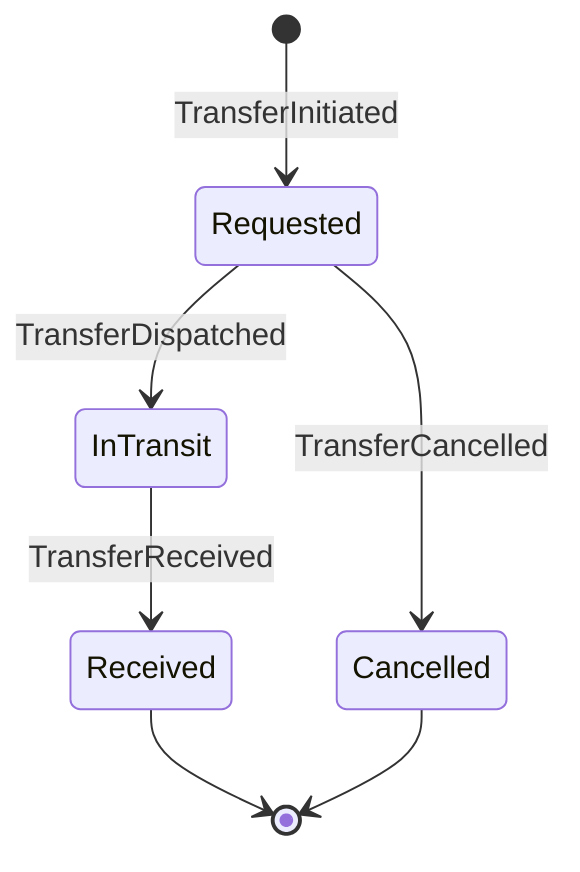

# 05 — Multisucursal y auditoría

> Nota de idioma: prosa en español, identificadores de código (entidades, eventos, campos) en inglés.

## 1. Modelo de sucursal

Una `Branch` es una unidad de **aislamiento parcial**: tiene su propio inventario físico, su propia caja, y usuarios asignados — pero comparte el mismo tenant (misma empresa, mismo plan de cuentas, mismos clientes globales).

- **Inventario por sede**: cada `Item` tiene un `Location` que referencia una sucursal (`branchId`). Un artículo solo puede estar físicamente en una sucursal a la vez.
- **Caja por sede**: cada sucursal abre/cierra su propia `CashRegister` diaria (ver [03-dominios-ddd.md](03-dominios-ddd.md#6-caja-cash)); no hay caja compartida entre sedes.
- **Usuarios por sede**: un `User` tiene una sucursal "base" (`homeBranchId`) y, opcionalmente, permisos extendidos a otras sucursales (para Gerencia/Auditor). Por defecto, un Cajero o Avaluador solo opera su sede asignada.

## 2. Traslados entre sucursales

Reglas:
- Un artículo en tránsito (`InTransit`) no aparece como "disponible" en ninguna de las dos sedes (evita venta duplicada).
- `TransferReceived` requiere confirmación explícita del usuario receptor — no es automático — para que la responsabilidad física del bien quede trazada.
- El traslado dispara un evento que actualiza la `Location` del artículo y dos entradas de auditoría (salida en origen, entrada en destino).

## 3. Auditoría — mecanismo transversal

**Principio de diseño: ningún comando de escritura se ejecuta sin generar un registro de auditoría en la misma transacción.** Esto no es un módulo aparte que se pueda desactivar — es un *cross-cutting concern* implementado como interceptor/middleware en la capa de aplicación, que envuelve cada `ApplicationService` de cada bounded context.

Cada registro de auditoría (`AuditLog`, contexto Security) contiene:

| Campo (código) | Descripción |
|---|---|
| `userId` | Quién ejecutó la acción |
| `branchId` | Desde qué sede/terminal |
| `entity` + `entityId` | Qué agregado se modificó |
| `action` | Comando ejecutado (ej. `ContractSettled`) |
| `oldValue` / `newValue` | Snapshot antes/después (diff) |
| `createdAt` | Cuándo (server-side, no confiable desde cliente) |
| `sourceIp` / `device` | Trazabilidad técnica |

- **Inmutabilidad**: la tabla de auditoría es solo-append; ningún rol, incluyendo Administrador, puede editar o borrar un registro desde la aplicación (a nivel de base de datos se protege con permisos de `INSERT`-only para el rol de aplicación).
- **Trazabilidad completa**: cualquier entidad (un `Contract`, un `Item`, una `CashRegister`) puede reconstruirse históricamente consultando su cadena de eventos de auditoría — esto también sirve como respaldo ante disputas legales o reclamos de clientes.
- **Alertas de auditoría**: ciertas acciones (diferencia de caja no resuelta, excepción de avalúo, cambio de rol) generan automáticamente una notificación a Auditor/Gerencia, no solo un registro pasivo.

## 4. Consolidación multi-sucursal para Gerencia

Los dashboards ejecutivos ([04-kpis-y-dashboards.md](04-kpis-y-dashboards.md)) agregan datos de todas las sucursales del tenant por defecto para roles de Gerencia/Auditor, con capacidad de filtrar por sucursal individual — nunca al revés (un Encargado de sucursal no puede ver el agregado de otras sedes).
