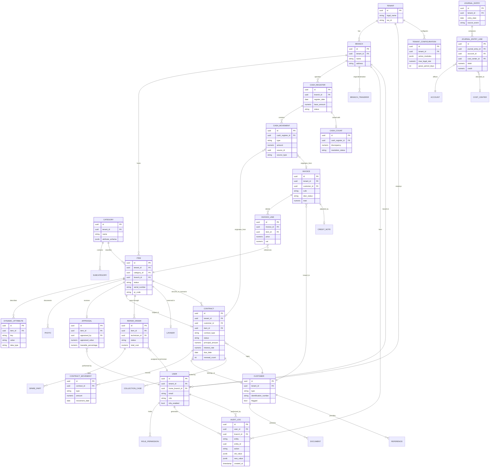

# 06 — Modelo de datos (ERD)

> Nota de idioma: nombres de tablas y columnas en **inglés** (es el literal que tendrá el esquema de base de datos); las notas explicativas están en español.

Diagrama entidad-relación de los agregados principales. Se omiten columnas triviales (timestamps estándar) para legibilidad; `tenant_id` y `branch_id` están presentes de forma transversal en casi toda tabla (multi-tenant desde el diseño, aunque el MVP sea single-tenant).

## Notas de diseño del modelo

- **`DYNAMIC_ATTRIBUTE` + `attribute_schema` en `CATEGORY`**: es el mecanismo que evita crear una tabla distinta por tipo de artículo (oro, celular, bicicleta, vehículo). La categoría define qué atributos son válidos y de qué tipo; el artículo los completa como filas clave-valor. Ver detalle en [09-modularidad-configuracion.md](09-modularidad-configuracion.md).
- **`CASH_MOVEMENT.source_id` / `source_type`**: referencia polimórfica controlada (no FK de base de datos, sino invariante de aplicación) hacia `CONTRACT` o `INVOICE` — todo movimiento de caja debe tener un origen de negocio trazable.
- **`AUDIT_LOG`** es *append-only* a nivel de permisos de base de datos, y referenciable desde cualquier entidad vía `entity` + `entity_id` (patrón polimórfico, no una FK por tabla).
- **Multi-tenancy**: casi toda tabla lleva `tenant_id`. En Fase 1-3 (single-tenant) esta columna existe pero no se usa para *routing*; en Fase 4-5 se convierte en la clave de aislamiento (row-level security en PostgreSQL).
- Las tablas `LAYAWAY` y `COLLECTION_CASE` referenciadas arriba se detallan en el módulo correspondiente ([03-dominios-ddd.md](03-dominios-ddd.md)); se omiten sus columnas aquí por brevedad ya que siguen el mismo patrón que `CONTRACT`.
