# 10 — Roadmap

## Fase 1 — MVP (un solo negocio, single-tenant)

**Objetivo**: validar el core operativo con un negocio real, sin todavía escalar a múltiples empresas.

- Módulos: Seguridad (auth básico, roles, sin MFA aún), Clientes, Inventario (con categorías/atributos dinámicos), Contratos (empeño + compra directa + venta, sin plan separe todavía), Caja (apertura/cierre/arqueo).
- Auditoría transversal activa desde el día uno (no es opcional, ni siquiera en MVP).
- Sin facturación electrónica todavía (venta registrada internamente; factura manual/externa mientras tanto).
- Una sola sucursal.
- Infraestructura: Railway (backend NestJS + PostgreSQL) + Cloudflare Pages (frontend) + Cloudflare R2 (fotos/documentos) — ver [08-arquitectura-tecnica.md](08-arquitectura-tecnica.md#6-cloud-railway--cloudflare-fase-1-2--aws-fase-3). Costo de infraestructura prácticamente $0/mes en esta fase.
- **Criterio de salida**: un negocio real puede operar su ciclo diario completo (recibir, avaluar, empeñar/comprar, vender) sin depender de planillas paralelas.

## Fase 2 — Operación completa

**Objetivo**: cubrir el ciclo financiero y legal completo de un negocio ya operando con el MVP.

- Plan Separe (apartado), Taller (reparaciones), Cartera/Cobranza (recordatorios, gestión de mora).
- Contabilidad: asientos automáticos desde eventos de Contratos/Caja/Inventario, plan de cuentas configurable.
- Facturación electrónica DIAN (Resolución 000165/2023).
- Multisucursal completo: traslados, caja y usuarios por sede.
- MFA obligatorio para roles de aprobación.
- **Criterio de salida**: el negocio puede cerrar su contabilidad mensual desde el sistema y operar más de una sucursal con trazabilidad completa.

## Fase 3 — ERP

**Objetivo**: convertir el sistema operativo en una herramienta de gestión para Gerencia.

- CRM (segmentación, campañas), Reportes/BI con dashboards ejecutivos ([04-kpis-y-dashboards.md](04-kpis-y-dashboards.md)), BFF GraphQL.
- Migración de eventos internos a cola (BullMQ/SQS) para soportar procesamiento asíncrono a mayor escala.
- Auditoría con alertas proactivas (no solo registro pasivo).
- **Criterio de salida**: Gerencia toma decisiones (qué categorías rotan, qué sucursal es más rentable) directamente desde el sistema, sin exportar a Excel.

## Fase 4 — Multiempresa

**Objetivo**: soportar varias empresas (tenants) operando de forma aislada sobre la misma plataforma, típicamente un mismo grupo económico con varias razones sociales.

- Aislamiento de datos por `tenant_id` con row-level security en PostgreSQL.
- Consolidación de reportes entre empresas del mismo grupo (vista agregada opcional para el dueño del grupo).
- Configuración de módulos y parámetros legales/financieros independiente por tenant ([09-modularidad-configuracion.md](09-modularidad-configuracion.md)).
- **Criterio de salida**: un mismo grupo empresarial administra dos o más compraventas con configuraciones de módulos distintas desde una sola cuenta de Gerencia consolidada.

## Fase 5 — SaaS

**Objetivo**: ofrecer la plataforma como producto a terceros, no solo para negocios propios.

- Onboarding self-service (registro de tenant nuevo, elección de módulos, configuración inicial guiada).
- Facturación del propio SaaS (planes, límites por plan, cobro recurrente).
- Aislamiento de infraestructura para tenants de alto volumen (base de datos dedicada cuando el tamaño lo justifique).
- Panel de administración de la plataforma (para el operador del SaaS, distinto del panel de cada tenant).
- **Criterio de salida**: un negocio nuevo, ajeno al equipo fundador, puede registrarse, configurar su tipo de negocio y operar sin intervención manual del equipo de desarrollo.

## Vista consolidada

```mermaid
gantt
    title Roadmap por fases (orden, no calendario fijo)
    dateFormat X
    axisFormat %s
    section Fase 1 MVP
    Core operativo single-tenant        :f1, 0, 3
    section Fase 2 Operación completa
    Contabilidad + Facturación + Multisede :f2, after f1, 3
    section Fase 3 ERP
    BI + CRM + eventos asíncronos       :f3, after f2, 3
    section Fase 4 Multiempresa
    Aislamiento multi-tenant            :f4, after f3, 2
    section Fase 5 SaaS
    Onboarding self-service             :f5, after f4, 3
```

