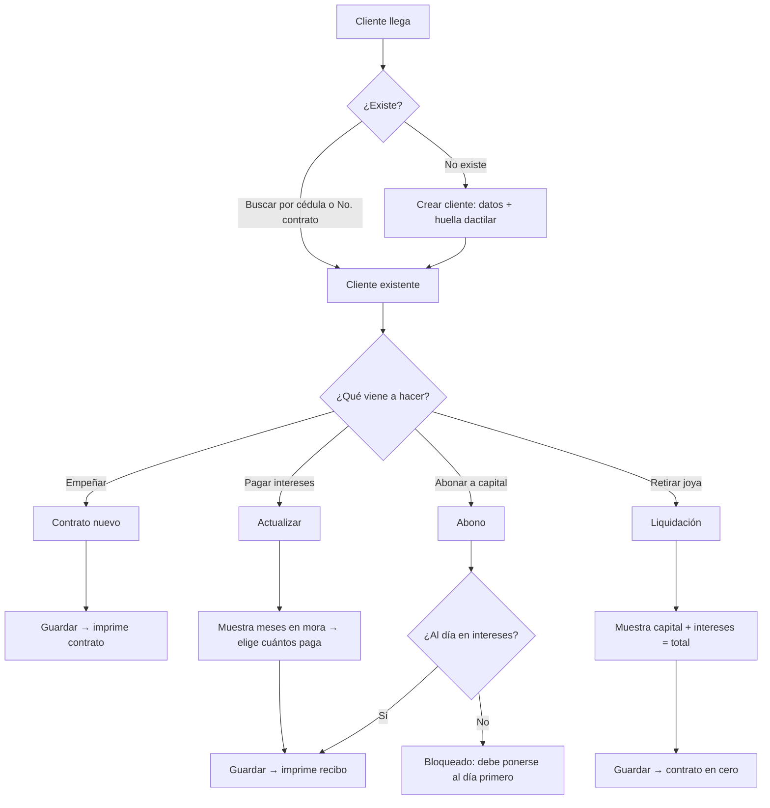

# 11 — Levantamiento de campo: compraventa "Carrera 113" (sistema legado en operación)

> **Fuentes primarias**:
> 1. [fuentes/2026-07-transcripcion-carrera113.md](fuentes/2026-07-transcripcion-carrera113.md) — transcripción de una sesión en sitio (2026-07) donde una empleada muestra en vivo el software legado que usan hoy.
> 2. [fuentes/2026-07-capturas-plus-cv-carrera113.md](fuentes/2026-07-capturas-plus-cv-carrera113.md) — nueve capturas de la **grabación de pantalla de esa misma sesión** (44:19, 2026-07-15), incorporadas el 2026-07-28. El video se daba por perdido; apareció y confirma buena parte de lo que antes solo estaba referido de palabra.
>
> **Naturaleza del documento**: descriptivo, no prescriptivo. Documenta **qué hacen hoy y con qué duele**. Las decisiones de diseño derivadas viven en [12-gap-analysis-y-backlog.md](12-gap-analysis-y-backlog.md).
> **Confianza**: alta para flujos operativos y para todo lo legible en las capturas, media para lo referido solo de palabra y para la aritmética inferida de ejemplos, baja para todo lo marcado como *[por confirmar]*.
> **Nombre del sistema legado**: **"Plus Cv"** (leído en su pantalla de inicio, C-01).

## 1. Contexto del negocio

Casa de empeño de joyería en Colombia, propiedad de "doña Leonor". Personas identificadas en la sesión:

| Persona | Rol funcional | Qué puede hacer en el sistema hoy |
|---|---|---|
| Doña Leonor — **LEONOR SANTA CRUZ** | Dueña | Todo. Su usuario es el único con inventario, remates, anulaciones y cierre de caja |
| Don Rafael | Administración/cierre | Cierre de caja nocturno (con el usuario de doña Leonor) |
| Empleadas/os de mostrador — **LINA MARIA GASCA MARTINEZ**, **ROBINSON HERNANDEZ LEITON**, **MARLEDY JARA ESPAÑA** | Operación diaria | Solo consulta de clientes, contratos nuevos, pagos y liquidaciones |
| Ingeniero (Barranquilla) | Soporte del sistema legado | Acceso remoto por AnyDesk. Único punto de mantenimiento |

Los nombres propios salen de las capturas: la barra de título de cada ventana muestra el **usuario de
la sesión** (`Ingreso de Transacciones Por Cliente - LINA MARIA GASCA MARTINEZ`,
`Mantenimiento de Contratos - LEONOR SANTA CRUZ`) y la columna "Elaborado por" del informe de caja
atribuye cada contrato a una persona. Detalle relevante para D-05: el informe del 15/07 atribuye dos
de los seis contratos del día a **LEONOR SANTA CRUZ** — o la dueña atendió mostrador, o alguien operó
con su usuario. La transcripción sugiere lo segundo *[por confirmar]*.

**Alcance del negocio hoy**: exclusivamente **empeño de oro 18K**. No compran otros quilates ni otros metales, no venden en mostrador, no usan plan separe ni consignación, aunque el software legado tiene esos menús —y las capturas los muestran completos: el informe de caja trae pestañas de `Ventas`, `Venta Oro`, `Remisiones`, `Plan Separe` y renglones de `Nota Débito`, `Nota Crédito`, `Compras de Mercancía` y `Cuota de Manejo Rev. Plan Sep.`, **todos en 0.00** en una jornada real completa.

Elemento no explicado por ninguna de las dos fuentes: un widget con forma de celular (`Saldo 0` /
`Recarga` / `Elija su paquete` / `Solicitar` / `Cancelar`) permanece visible en el costado izquierdo
de **todas** las pantallas. Parece un módulo de venta de recargas de celular embebido en el mismo
software. Nadie lo mencionó en la sesión — ver §6.

## 2. Reglas de negocio observadas

| # | Regla | Evidencia | Confianza |
|---|---|---|---|
| RN-01 | Interés fijo del **4% mensual**, uniforme para todo contrato y todo monto | *"Sobre el 4% siempre. No importa lo que sea."* | Alta |
| RN-02 | Plazo contractual base: **6 meses** de pago de intereses | *"la persona tiene seis meses para el pago de intereses"* | Alta |
| RN-03 | **No se puede abonar a capital si hay intereses en mora.** El sistema exige estar al día antes de habilitar el abono | *"tengo que estar al día de intereses para poder realizar el abono"* | Alta — la empleada lo señala como el "plus" del programa |
| RN-04 | Se permite **pago parcial de intereses** (p. ej. 1 de 2 meses adeudados) | *"Si yo quisiera pagar por un mes de estos dos meses lo puedo hacer"* | Alta |
| RN-05 | El remate **no es automático al vencimiento**. Es una decisión discrecional de la dueña, en la práctica a partir de **8 meses** de antigüedad | *"a doña Leonor casi no le gusta rematar joyas... de una vez a seis meses ella no las remata nunca"* | Alta |
| RN-06 | Solo se recibe **oro 18K**; el quilataje viene preseleccionado en pantalla, no se elige | *"aquí no recibimos sino solo de empeño oro y de 18 quilates"* | Alta |
| RN-07 | Un único tipo de contrato: **"001"**, contrato de compraventa | *"siempre es así 001. No hay más opciones"* | Alta |
| RN-08 | El **consecutivo de contrato lo genera el sistema**, y se transcribe además a un **libro físico** paralelo | *"El programa automáticamente bota el número. Y nosotros tenemos unos libros donde llevamos el registro del consecutivo"* | Alta |
| RN-09 | El saldo de caja **no se retira al cierre**: continúa como saldo inicial del día siguiente | *"Sí, continúa para el siguiente día"* | Alta |
| RN-10 | Los domingos no se labora, pero el cierre del domingo **debe ejecutarse el lunes** para poder abrir la fecha del lunes | *"él tiene que hacer cierre del domingo para poder que aquí nos quede a fecha de lunes"* | Alta |
| RN-11 | Al procesar un remate, el contrato queda **bloqueado y se muestra en rojo** al consultarlo | *"cuando el cliente viene, consulta y sale en rojo lo que el cliente perdió"* | Alta |
| RN-12 | El recibo/boleta físico es el instrumento de retiro de la joya | *"no lo pierdan porque con eso es que retira la joya"* | Alta |
| RN-13 | El interés se liquida por **mes completo**, no prorrateado por días | Inferido del flujo "debo 2 meses → pago 1 mes = $8.000". **Reforzada por las capturas**: ver RN-16 | **Media — por confirmar** el redondeo, ya no el mes completo |
| RN-14 | La anulación de un contrato **también anula el consecutivo** (no se reutiliza) | *"El consecutivo también se anula"* | Media — ambigua: puede significar "se marca anulado" y no "se libera" |

### 2.1 Reglas incorporadas desde las capturas (2026-07-28)

| # | Regla | Evidencia | Confianza |
|---|---|---|---|
| RN-15 | El tipo de contrato "001" trae **parámetros fijos precargados**: plazo 6 meses, `Retroventa 4.00`, `Valor Mínimo 20.000`, `Valor Máximo 10.000.000` y `Artículos 100` (tope de artículos por contrato) | Cabecera del contrato nuevo en C-04: *"001 CONTRATO DE COMPRAVENTA · 6 Mes(es) · Artículos 100 · Valor Mínimo 20,000.00 · Valor Máximo 10,000,000.00 · Retroventa 4.00"* | Alta — leído en pantalla. Que sean *editables por parámetro* es inferencia |
| RN-16 | La mora **se cuenta desde la última actualización (`Fecha Act`), no desde el inicio del contrato**, y cualquier mes empezado se cobra completo | C-02: `Fecha Act 21/05/2026`, `Vencido 1\|25`, `Sob.Cto. Pend. 16.000` = 200.000 × 4% × **2**. C-09: `Fecha Act 16/05/2026`, `Vencido 1\|30`, `Sob.Cto. Pend. 92.000` = 1.150.000 × 4% × **2** | Alta para el conteo desde `Fecha Act`; **Media — por confirmar** para el redondeo (dos ejemplos concordantes, ninguno verbalizado) |
| RN-17 | Pagar N meses **corre la fecha de corte N meses hacia adelante** (`Fecha N.`), aunque quede en el futuro respecto de la fecha de caja | C-09: al marcar `Liqui` con 2 meses, `Fecha N.` pasa a `16/07/2026` estando la caja en `15/07/2026` | Alta — observado en pantalla |
| RN-18 | El plazo de 6 meses **no cambia con los pagos**: `Fecha Vence` se fija al crear el contrato y `Periodo Actualizado` queda en `0M0D` | C-04 (`Fecha Inicio JUL. 15/2026 → Fecha Vence ENE. 15/2027`), C-02 y C-09 (`Periodo Actualizado: 0M0D` en contratos con 2 meses de mora) | **Media — por confirmar**: no se observó ningún contrato con actualizaciones registradas |
| RN-19 | El sistema **sí ofrece otros metales y quilates** (10k, 12k, 14k, 16k, 18k, 22k, 24k, Platino, Plata, Otro); 18k viene preseleccionado. La restricción a oro 18K es **política del negocio**, no del software | Grupo de radios en C-04, con `18k` marcado | Alta — matiza RN-06 |
| RN-20 | El catálogo de clases de artículo es **cerrado y preparametrizado**, con códigos `001xx` no contiguos y orden alfabético; incluye la clase **`00130 LOTE DE JOYAS`** para empeños de varias piezas en un solo contrato | C-03: ANILLO 00105, ARETE 00112, ARGOLLA 00106, ARO 00108, CADENA 00101, CAMANDULA 00103, CANDONGA 00114, CASANDRA 00109, DENARIO 00111, DIJE 00115, GARGANTILLA 00102, GUAYA 00104, LOTE DE JOYAS 00130, PULSERA 00107, PULSO DE RELOJ 00116 | Alta |
| RN-21 | Los estados de contrato del legado son cinco: **Vigentes · Vencidos · Liquidados · Resueltos · Anulados**, y el sistema los resume por cliente con monto y porcentaje | "Resumen de Contratos del Cliente por Estado" en C-04: Vigentes 1 / 200.000 / 14.00%, Liquidados 6 / 1.800.000 / 85.00%, Total 7 / 2.200.000 | Alta. "Resuelto" = rematado, por coherencia con RN-11 *[por confirmar el término exacto con el negocio]* |
| RN-22 | El sistema **proyecta el calendario de vencimientos** del contrato mes a mes (`Vencimiento · Retroventa · Pago Total`) desde la ficha del cliente | Tabla en C-04 con filas AGO. 15/2026, SEP. 15/2026, OCT. 15/2026, NOV. 15/2026 | Alta |
| RN-23 | La anulación exige **causal tipificada de una lista**, no texto libre | Combo `Causal de Anulación` en C-08 mostrando `CLIENTE DESISTIÓ DE TRANSACCIÓN` | Alta |
| RN-24 | La caja lleva un **libro de movimientos con saldo corrido y hora de proceso**: débito = entrada de efectivo, crédito = salida | Pestaña `Extracto de caja` en C-07: 16 filas encadenadas sin descuadre, de 11:50 a 17:33, cerrando en 10.471.260 | Alta — verificado aritméticamente fila por fila |
| RN-25 | En el libro de caja, cada operación se registra con **la terminología legal**: `RECOMPRA PAGADO POR ACTUALIZACION DEL CONTRATO #`, `RETROVENTA PAGADO POR LIQUIDACION`, `CAPITAL LIQUIDACION`, `ABONO A CAPITAL`, `CONTRATO #` | Columna `Detalle` en C-07 | Alta — el legado ya separa idioma legal (documentos/libro) del idioma del operador (pantalla) |
| RN-26 | La liquidación de un contrato genera **dos asientos separados** en caja: capital y retroventa | C-07, contrato 92627 a las 16:11: `RETROVENTA … 72.000` y `CAPITAL LIQUIDACION … 1.800.000` | Alta |
| RN-27 | La ficha del cliente captura **régimen fiscal** (`Responsables del IVA` / `No responsables del IVA`), lugar de expedición del documento, código de ciudad DANE y correo | C-02 (`No responsables del IVA`, `C.Ciudad 18001`) y C-09 (`Responsables del IVA`) | Alta — es el insumo que hoy se re-digita en Samir (D-02) |
| RN-28 | Existe un campo **`Dto Sob.Cto`** (descuento de sobrecosto) en la grilla de pagos | Columna visible en C-02 y C-09, ambas en `0.00` | **Baja — por confirmar**: nunca se vio usado ni se mencionó. Puede ser una facultad de negociación de la dueña |

## 3. Flujos operativos observados

### 3.1 Ciclo diario de mostrador

**Detalle de "Contrato nuevo"**: se elige tipo de joya de un catálogo preparametrizado (gargantilla, aretes, cadenas, anillos…), se escribe una descripción libre con novedades del artículo (*"tiene piedra roja", "está partida", "no tiene piedras"*), se ingresa el peso en gramos, el quilataje ya viene fijo en 18K, y se ingresa el monto a prestar. Guardar genera e imprime el contrato en un solo paso.

**Detalle de "Actualizar"**: el sistema calcula y muestra cuántos meses de interés se adeudan al día de hoy. La empleada elige por cuántos meses paga y el sistema muestra el valor. Si paga menos del total adeudado, el abono a capital queda deshabilitado (RN-03).

La grilla donde ocurre todo esto (C-02, C-09) es **una sola fila por contrato con 17 columnas**, y su
estructura explica el modelo mental del operador. Se lee en dos mitades:

| Mitad izquierda — **situación actual** | Mitad derecha — **lo que se va a cobrar ahora** |
|---|---|
| `Contrato` · `Fecha Act` (fecha de corte vigente) · `Vencido` en meses y días · `Valor` (capital original) · `Abono` · `Saldo` · `Sob.Cto. Pend.` | `Actual` ☐ / `Liqui` ☐ (qué operación se hace) · `Actualiza` en meses y días · `Sob.Cto. Pag.` · `Dto Sob.Cto` · `Abono` · `Saldo` resultante · `Fecha N.` (nueva fecha de corte) |

El operador **no digita plata**: marca `Actual` (pagar intereses) o `Liqui` (liquidar), y el sistema
llena la mitad derecha. Es exactamente el comportamiento que la empleada llama *"el plus del
programa"*. Al pie, `Pago Total =>` y `Total a Pagar =>` muestran el efectivo a recibir.

### 3.2 Caja

- **Movimiento diario** (`caja → movimiento diario`): registro manual de **ingresos** (base adicional que entrega la dueña cuando se agota el presupuesto para empeñar, p. ej. $5.000.000, concepto libre "base") y **egresos** (retiros por exceso de efectivo en caja, concepto libre "retiro" o "préstamo a doña Leonor"). Afecta el saldo inmediatamente.
- **Arqueo informal de mediodía**: se filtra el día actual, el sistema muestra intereses cobrados, abonos, contratos liquidados y el **saldo esperado en caja**. Se confronta contra el efectivo físico. Si no cuadra, se revisa contrato por contrato buscando el error (típicamente: se liquidó un contrato y no se le dio guardar).
- **Cierre de caja nocturno**: exclusivo del usuario de la dueña, lo ejecuta don Rafael. Al cerrar, el sistema avanza la fecha de operación al día siguiente. El saldo no se retira (RN-09).

### 3.3 Remate

1. Filtrar contratos vigentes por antigüedad — el filtro se usa como **"60 a 1000"** (interpretado como rango de días o de meses *[por confirmar]*), grupo "joyería".
2. El sistema lista los contratos vigentes con más de ~8 meses.
3. La dueña **selecciona manualmente** cuáles rematar (no es una selección masiva por criterio).
4. Los seleccionados pasan a una segunda pantalla y se "procesan": salen del listado de vigentes y quedan bloqueados/en rojo.

### 3.4 Anulaciones

Único mecanismo de corrección disponible. Solo con el usuario de la dueña. Se aplica a:
- Contratos elaborados con error (artículo equivocado, **monto equivocado**).
- Pagos de intereses registrados por error — caso frecuente cuando un cliente con varios empeños pregunta saldos de cada uno y el operador termina guardando un pago sobre el contrato equivocado.

### 3.5 Novedades del cliente

Campo de observaciones por cliente/contrato (el "globito"). Uso real y **diario**: registrar que el cliente perdió, botó, dañó o le robaron el recibo. Es un control antifraude de facto — los clientes vienen a avisar de un robo justamente para que no se retire la joya con el recibo robado.

### 3.6 Doble digitación hacia "Samir" (facturación electrónica)

Todos los días se **imprime en papel** el informe de pagos de intereses del día, y esa información se **re-digita manualmente** en Samir, el sistema de facturación electrónica, para emitir la factura de cada cliente que pagó intereses. No existe integración ni exportación. Es el desperdicio operativo más grande identificado en la sesión.

### 3.7 El informe de caja por dentro (C-06, C-07)

Es la pantalla que la empleada dice imprimir a diario. Tiene tres capas:

1. **Resumen de dos columnas** por rango de fechas (ese día: 15/07 a 15/07). A la izquierda las
   entradas —`Contratos Liquidados 6.100.000` con su `SobreCostos 598.000` y el `9,80%` que resulta
   de dividirlos, `Contratos Actualizados 600.000` con `SobreCostos 412.000`, y siete renglones más
   en cero—, subtotal `7.710.000`. A la derecha las salidas, con un único renglón vivo:
   `Contratos de CompraVenta 5.650.000`, subtotal `5.650.000`.
2. **Nueve pestañas de detalle**: `Contratos realizados`, `Contratos actualizados`,
   `Contratos liquidados`, `Ventas`, `Venta Oro`, `Remisiones`, `Gastos`, `Extracto de caja`,
   `Plan Separe`. La de contratos realizados lista los seis del día con cliente, valor, plazo,
   vencimiento y **quién lo elaboró**, y suma exacto el egreso del resumen. Al seleccionar una fila
   muestra el artículo con peso bruto, peso neto y costo.
3. **Extracto de caja**: el libro de movimientos con saldo corrido (RN-24, RN-25).

Dos botones que la sesión no explicó: **`Abrir Caja`** y **`Enviar Informe`** — este último sugiere
que el legado ya tiene una vía de envío (¿correo?) del informe diario. Ver §6.

**Volumen de una jornada real** (15/07/2026, sábado a miércoles indistinto): 6 contratos nuevos por
$5.650.000, 1 abono a capital, 1 liquidación de $1.800.000 + $72.000 de retroventa, otra de
$2.000.000, y ~7 pagos de actualización entre $4.000 y $240.000. Saldo de caja moviéndose entre
$8,3 y $11,4 millones. Es la primera medición dura de volumen y de efectivo en caja que tenemos.

### 3.8 Corrección y mantenimiento de contratos (C-08)

La pantalla `Mantenimiento de Contratos` —solo accesible con el usuario de la dueña, según la
transcripción, y en la captura efectivamente abierta bajo la sesión `LEONOR SANTA CRUZ`— reúne
mucho más que la anulación:

- `Anula Contrato` y un combo obligatorio **`Causal de Anulación`** con causales tipificadas
  (la visible: `CLIENTE DESISTIÓ DE TRANSACCIÓN`).
- `Anula Resolución` — presumiblemente revertir un remate ya procesado *[por confirmar]*.
- **`Actualiza Datos`** — un botón de edición que contradice en apariencia el dolor D-01. La
  empleada afirma que para corregir la descripción o el monto *"me toca anular el contrato"* y que
  esa opción *"no la tiene ni ella"* (la dueña). Lo más probable es que `Actualiza Datos` edite los
  **datos del cliente**, no los del contrato. Ver §6.
- `Reimprime Lables` *(sic, etiquetas)*, `Reimprime Contrato`, `Certificado de Propiedad`,
  `Imprime Formato` — cuatro salidas impresas distintas, de las que solo conocemos el contrato.
- `Actualización` aparece **deshabilitado** para este contrato, creado el mismo día y sin pagos.

## 4. Dolores identificados (voz del usuario)

| # | Dolor | Impacto | Cita |
|---|---|---|---|
| D-01 | **No se puede editar nada.** Un error de descripción o de monto obliga a anular el contrato completo y rehacerlo | Alto — ocurre con frecuencia, especialmente con personal nuevo. Caso real: prestó $1.400.000 en vez de $2.400.000 | *"tiene uno que anular el contrato completo para poder escribir cualquier palabra"* |
| D-02 | **Doble digitación con Samir** | Alto — trabajo diario duplicado sobre el 100% de los pagos | *"Por eso es que tenemos doble trabajo"* |
| D-03 | **Sin notificaciones al cliente**. No hay aviso de vencimiento ni de próximo remate | Medio/alto — reclamos reales de clientes que perdieron la joya sin aviso; además el art. 1943 C.C. exige aviso previo de 15 días | *"llega una cliente y dice: ay, ustedes por qué no me avisaron"* |
| D-04 | **Los informes no funcionan.** Solo dos son confiables (movimiento del día y listado para remate); el resto se abandonó | Medio — la gerencia no tiene visibilidad real | *"de informes la verdad casi no manejamos porque eso nunca nos funciona"* |
| D-05 | **Todo el sistema es el usuario de la dueña.** Como el rol de empleada solo cubre empeños, cualquier otra tarea se hace con las credenciales de doña Leonor | Alto — destruye la trazabilidad: la auditoría atribuye a la dueña acciones de terceros | *"El resto de procesos sólo los hace con el usuario de doña Leonor"* |
| D-06 | **Bugs de estabilidad**: el sistema deja de aceptar entrada numérica cuando hay dos sesiones de AnyDesk abiertas; las sesiones se caen | Medio — pérdida de tiempo frente al cliente | *"no dejan ni coger los números"* |
| D-07 | **Dependencia de una sola persona** (ingeniero en Barranquilla, vía AnyDesk) y de **un solo computador**, sin nube ni respaldo verificable | **Crítico** — riesgo de pérdida total del histórico | *"es fijo ahí en el computador"* |
| D-08 | **Libro físico paralelo** del consecutivo | Bajo/medio — trabajo manual redundante, probablemente heredado de una exigencia legal o de desconfianza en el sistema *[por confirmar cuál]* | *"tenemos unos libros donde llevamos el registro del consecutivo"* |
| D-09 | **Funciones muertas**: huella dactilar capturada y nunca validada, cámara de fotos del artículo, escáner de documentos, mensajería, venta, plan separe, terceros | Medio — el software "miente" sobre sus capacidades y entrena al usuario a ignorar la UI | *"están ahí los iconos pero nunca las hemos usado"* |
| D-10 | **El contrato admite hasta 100 artículos, pero los empeños de varias piezas se registran como una sola línea de texto corrido** bajo la clase `LOTE DE JOYAS` | Alto — el inventario deja de ser inventariable: peso y costo quedan agregados (5,90 g y $1.150.000 para tres piezas), la descripción se trunca en pantalla, y al rematar no hay forma de valorar ni sacar una pieza suelta | C-09: *"LOTE DE JOYAS 18k 1 CADENA CARTIER ER 1 DIJE PLACA GRABADO ROSTRO ER 1 DIJE DE C…"* (cortado) |
| D-11 | **La ubicación física de la joya nunca se registra**, pese a existir el campo `Ubicación` y un botón `Reimprime Lables` (etiquetas) | Medio — localizar la pieza al retirar o al rematar depende de una práctica manual no documentada; con ~92.700 contratos históricos es un riesgo operativo real | `Ubicación` vacío en C-02, C-04 y C-08; y la transcripción sobre los campos vecinos: *"eso ahí nunca sale nada"* |

## 5. Contraste con el diseño ya documentado

Coincidencias que **validan** el diseño existente en [03-dominios-ddd.md](03-dominios-ddd.md) y [02-ciclos-de-vida.md](02-ciclos-de-vida.md):

- El estado **Retirado / Anulado** de contrato existe en la operación real y es de uso frecuente.
- La distinción **actualización (pago de sobrecosto sin abonar capital)** vs. **abono a capital** vs. **liquidación** coincide exactamente con lo modelado.
- **Caja con saldo continuo, arqueo y cierre restringido por rol** coincide con el ciclo de vida de Caja modelado.
- El **remate como decisión humana** posterior al vencimiento, no como transición automática, coincide con el estado `Vencido → periodo de gracia → Resuelto`.

Divergencias que **obligan a ajustar** el diseño:

| Diseño actual | Realidad observada | Acción |
|---|---|---|
| Terminología "valor de compra / valor de retroventa / sobrecosto" | El negocio y sus empleados hablan de **"préstamo", "intereses", "abono a capital", "liquidar"** — pero el legado **ya hace la separación correcta**: sus pantallas dicen `Sob.Cto.` y `Retroventa`, y su libro de caja escribe `RECOMPRA PAGADO POR ACTUALIZACION` / `RETROVENTA PAGADO POR LIQUIDACION` (RN-25) | Se confirma la acción, con matiz: idioma del operador en la UI de mostrador, idioma legal en documentos impresos **y en los asientos contables**, que es donde el legado lo usa |
| Contrato inmutable, corrección solo por anulación | Necesidad explícita de **edición con trazabilidad** | Nuevo requisito: edición controlada con auditoría y motivo obligatorio |
| Facturación electrónica como módulo Fase 2 | Ya existe un sistema externo (Samir) con doble digitación | Adelantar al menos la **exportación** de pagos a un formato importable |
| Remate por vencimiento de plazo | Antigüedad discrecional (8+ meses) definida por la dueña | El umbral de remate debe ser **parámetro configurable**, no el plazo del contrato |
| Los estados de contrato de [02-ciclos-de-vida.md](02-ciclos-de-vida.md#22-contrato-contract) son 8 (`Created`, `Active`, `Overdue`, `Expired`, `Redeemed`, `Forfeited`, `Cancelled`, `Renewed`) | El legado opera con **cinco** y el negocio razona en esos cinco: Vigente · Vencido · Liquidado · Resuelto · Anulado (RN-21) | Mantener los estados internos, pero **agrupar la presentación** en esos cinco. El resumen por cliente (conteo, monto y % por estado) es una pantalla que el legado ya tiene y que conviene replicar |
| La mora se deriva de `dueDate` (vencimiento del contrato) | La mora se cuenta desde la **última actualización** `Fecha Act`, un eje distinto: un contrato dentro del plazo de 6 meses puede tener 2 meses de intereses vencidos (RN-16) | `Contract` necesita una **fecha de corte de intereses** independiente de `dueDate`, que avance con cada pago (RN-17). Sin ella, ningún cálculo de mora reproduce el sistema actual |
| Un contrato tiene N artículos como entidades | En la práctica, N piezas se aplastan en **una línea de texto** (D-10) | La migración del histórico debe prever que el campo descripción trae varias piezas concatenadas y **no es parseable de forma confiable** |

## 6. Vacíos por cerrar

Estado revisado el 2026-07-28 tras incorporar las capturas.

1. ~~**Capturas pendientes de incorporar**~~ — **parcialmente cerrado**. El video de la sesión
   **no se había perdido**: existe (44:19) y de él salieron las nueve capturas. Sigue faltando el
   **contrato impreso**, el **recibo de pago** y la **pantalla de inventario/remates**, y quedan
   ~44 minutos de video sin revisar. Los PNG originales aún no están versionados en
   `docs/fuentes/capturas/`.
2. **Formato de importación de Samir**: se preguntó y quedó sin responder (la grabación se corta justo ahí). Es el bloqueante de D-02. **Sin cambios.**
3. **Cálculo exacto del interés** — **parcialmente cerrado**. Dos ejemplos en pantalla muestran que
   `1 mes y 25 días` y `1 mes y 30 días` de mora cobran **2 meses completos** (RN-16), y que pagar
   corre la fecha de corte N meses aunque quede en el futuro (RN-17). **Siguen abiertos**: el
   redondeo de cifras (todos los valores observados son múltiplos exactos, no hubo un solo caso con
   centavos) y qué ocurre entre el mes 6 y el remate.
4. **Semántica del filtro "60 a 1000"** en la pantalla de remates. **Sin cambios** — esa pantalla no
   aparece en ninguna captura.
5. **Origen del libro físico**: ¿exigencia legal, política interna, o desconfianza en el sistema?
6. **Anulación del consecutivo**: ¿el número se marca anulado o se libera para reutilizarse? Afecta el diseño de numeración.
7. **Volumen real** — **parcialmente cerrado**. El 15/07/2026 se hicieron **6 contratos nuevos**
   ($5.650.000 desembolsados), **~7 actualizaciones**, **2 liquidaciones** y **1 abono a capital**,
   con la caja moviéndose entre $8,3 y $11,4 millones. El último consecutivo sigue siendo **92.751**.
   Falta confirmar si es un día típico.
8. **¿Existe respaldo?** Nadie lo mencionó. Debe verificarse antes que cualquier otra cosa.

Vacíos nuevos abiertos por las capturas:

9. **El widget de recargas** (`Saldo 0 / Recarga / Elija su paquete / Solicitar / Cancelar`), presente
   en todas las pantallas: ¿es un negocio adicional del mostrador, un módulo del mismo proveedor, o
   software de un tercero? ¿Alguien lo usa? Nadie lo mencionó en la sesión.
10. **`Actualiza Datos`** en la pantalla de mantenimiento: ¿qué edita exactamente? Si edita datos del
    contrato, D-01 estaría mal caracterizado; si edita solo datos del cliente, hay que decirlo.
11. **`Anula Resolución`**: ¿"resolución" es el remate, una resolución de facturación DIAN, u otra cosa?
12. **`Enviar Informe`** y **`Abrir Caja`** en el informe de caja: ¿el legado ya envía el informe
    diario a alguien (correo)? Si existe, es la vía más corta hacia D-02.
13. **`Dto Sob.Cto`** (RN-28): ¿se descuentan intereses alguna vez? ¿quién lo autoriza y con qué criterio?
14. **El sufijo "ER"** que aparece al final de casi toda descripción de artículo
    (`CANDONGA 18k 1} PAR ER`, `CADENA 18k 1 TEJIDO CARTIER ER`, `ANILLO 18k CIRCONES VERDES ER`):
    ¿iniciales de quien recibe, estado de la pieza, o convención de digitación?
15. **`Cupo` / `Cupo Total`** en la ficha del artículo, siempre en 0.00: ¿cupo de crédito del cliente,
    avalúo máximo de la pieza, otra cosa?
16. **Pesos bruto y neto**: el legado los pide por separado pero en el único caso con datos son
    iguales (3,50 y 3,50). ¿Se usa la distinción, o se copia el mismo valor siempre?
17. **`Estado de Cuenta R / D`** (los dos botones junto a la ficha del cliente) y los botones
    `Detallado` / `Resumido`: ¿qué imprime cada uno? Enlaza con el vacío 1.
