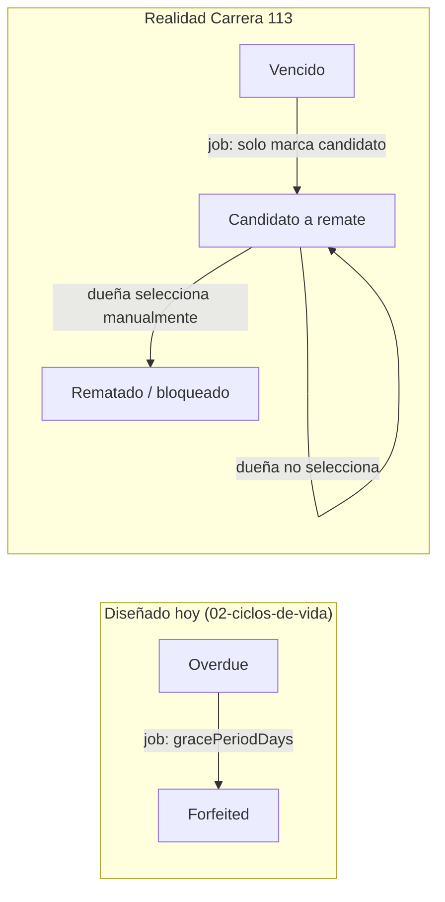

# 12 — Gap analysis y backlog priorizado

> **Entradas**: [11-levantamiento-campo-carrera113.md](11-levantamiento-campo-carrera113.md) (reglas RN-01..RN-28, dolores D-01..D-11) y sus fuentes — la [transcripción](fuentes/2026-07-transcripcion-carrera113.md) y las [capturas del sistema legado](fuentes/2026-07-capturas-plus-cv-carrera113.md) —, contrastadas contra el diseño documentado en [01](01-investigacion-negocio.md)–[10](10-roadmap.md) y contra el **código realmente existente**.
> **Actualización 2026-07-28 (tarde)**: las capturas del legado añadieron RN-15..RN-28 y D-10/D-11. Su efecto sobre el backlog está en la §3.11 y en los items **CV-029..CV-033**; el resto del documento conserva el análisis previo como línea base.
> **Naturaleza del documento**: prescriptivo. Es el puente entre "qué hace el negocio hoy" y "qué construimos".
> **Método**: cada veredicto de la sección A se obtuvo leyendo `apps/backend/prisma/schema.prisma` y los servicios de `apps/backend/src/modules/*`. Las citas `archivo:línea` son verificables. Donde no se pudo verificar, dice **[por verificar]** — no se infiere.
> **Estado del código al momento del análisis**: backend NestJS con 12 módulos y ~2.900 líneas de TypeScript; frontend React con 13 páginas. Sin suite de pruebas detectada.

## 0. Estado de implementación

Primera tanda ejecutada (2026-07-28). El análisis de las secciones siguientes describe el estado **previo** a estos cambios y se conserva tal cual como línea base.

| Item | Estado | Dónde |
|---|---|---|
| CV-002 Motor de intereses | **Hecho** (backend) | [`interest-calculator.ts`](../apps/backend/src/modules/contracts/interest/interest-calculator.ts) — módulo puro, sin Prisma |
| CV-007 Abono bloqueado con intereses en mora (RN-03) | **Hecho** | `contracts.service.ts` → `payPrincipal()` |
| CV-008 Consecutivo por sucursal | **Hecho** | `Contract.contractNumber` + modelo `ContractSequence`, reservado con `upsert`/`increment` **dentro de la transacción** que crea el contrato, para que un fallo no deje huecos en la serie |
| CV-009 Pago de intereses ≠ renovación | **Hecho** | `payInterest()` no toca `dueDate` ni el estado; `renew()` exige estar al día |
| CV-010 Remate como decisión humana | **Hecho** | `processOverdueContracts()` ya no remata; `listForfeitureCandidates()` + `forfeitContracts()` |
| CV-014 Pruebas de las reglas de dinero | **Parcial** | 23 pruebas del motor de intereses en verde; falta cubrir caja y anulaciones |
| CV-015 Unidad de tasa vs. usura | **Hecho** | `monthlyToEffectiveAnnual()` aplicada en `create()` |
| CV-021 Configuración editable | **Parcial** | Los parámetros existen en `TenantConfiguration`; falta la pantalla de Gerencia |
| CV-010 Remate como decisión humana | **Hecho** (2026-07-28) | Ya existía en backend pero **sin ninguna pantalla**: la función era inalcanzable desde la aplicación. Nueva [`ForfeiturePage.tsx`](../apps/frontend/src/pages/ForfeiturePage.tsx) con selección individual (sin "seleccionar todo") y confirmación de dos actos. Además `forfeitContracts()` pasó a ser **todo o nada**: antes validaba dentro del bucle y un contrato inválido a media tanda dejaba los anteriores ya rematados. 4 pruebas en [`forfeiture-atomicity.spec.ts`](../apps/backend/src/modules/contracts/forfeiture-atomicity.spec.ts) |
| CV-020 Catálogo de joyas y validación de atributos | **Hecho** (2026-07-28) | Las 15 clases del legado sembradas con su código original (`00101 CADENA` … `00130 LOTE DE JOYAS`) como subcategorías de "Oro", que aporta el `attributeSchema` heredado. `createItem()` ya **valida contra el esquema** —antes persistía `dto.attributes` a ciegas pese a que [09](09-modularidad-configuracion.md) afirmaba lo contrario—. La pantalla de inventario pide clase de una lista, peso obligatorio y quilataje con 18k preseleccionado; antes no pedía ninguno de los dos. 26 pruebas del validador |
| CV-032 Libro de caja (pantalla) | **Hecho** (2026-07-28) | [`CashStatementPage.tsx`](../apps/frontend/src/pages/CashStatementPage.tsx) sobre el endpoint nuevo, con las columnas del legado y el saldo corrido del servidor |
| CV-034 Secreto JWT | **Hecho** (2026-07-28) | Ver §4.6 |
| CV-029 Devengo por mes empezado (RN-16) | **Hecho** (2026-07-28) | `startedMonthsBetween()` en [`interest-calculator.ts`](../apps/backend/src/modules/contracts/interest/interest-calculator.ts); enum `InterestAccrualPolicy.FullMonthCeil` como default; migración [`20260728210000_devengo_mes_empezado`](../apps/backend/prisma/migrations/20260728210000_devengo_mes_empezado/migration.sql) aplicada y con backfill de las configuraciones existentes. 10 pruebas nuevas (33 en total, en verde), dos de ellas reproducen contrato por contrato las cifras del sistema legado |

Además, el importe de la liquidación y el del pago de intereses **los calcula el servidor**: el operador elige cuántos meses paga, no cuánta plata entrega. La pantalla de contratos muestra un estado de cuenta real (capital vigente, interés mensual, meses adeudados, total para retirar).

### 0.1 Decisión de negocio que este código destapó: la tasa contra la usura

Al corregir la comparación de unidades (CV-015) salió a la luz algo que el bug anterior ocultaba: **4% mensual equivale a ~60.10% efectivo anual**, muy por encima del `maxLegalRate` configurado (19.50% E.A.) y con toda probabilidad por encima de la usura vigente. Es exactamente el riesgo descrito en [01-investigacion-negocio.md](01-investigacion-negocio.md) §1.2 — un juez puede recalificar el contrato y aplicar el tope igual que a un préstamo, y cobrar por encima es delito (C.P. art. 305).

Aplicar el tope como bloqueo duro habría dejado el sistema inservible: ningún contrato del negocio se podría registrar. Por eso la conducta es un parámetro, `TenantConfiguration.usuryCapPolicy`:

- `Block` — rechaza el contrato. Legalmente conservador.
- `Warn` (**default**) — registra el contrato y deja el exceso en el log. Se eligió como default porque un sistema que se niega a registrar lo que el negocio realmente hace no corrige la práctica: la devuelve al papel, donde nadie la audita.

**Esto no lo decide el desarrollo.** Hay que llevarlo al negocio y a su abogado, junto con el valor real de `maxLegalRate` que corresponda a la certificación vigente de la Superintendencia Financiera. Queda añadido como pregunta a la §5.

### 0.2 Entorno y migración — resuelto

El bloqueo de base de datos no era de credenciales sino un **choque de puertos**: el contenedor `compraventa-postgres` llevaba días sin arrancar porque otro proyecto ocupaba el 5433, y Prisma estaba autenticándose contra una base ajena. Se movió a **5435** conservando su volumen; `DATABASE_URL` actualizado en `.env`.

La migración [`20260728120000_empeno_intereses_consecutivo`](../apps/backend/prisma/migrations/20260728120000_empeno_intereses_consecutivo/migration.sql) está **escrita a mano y aplicada**. `branchId` y `contractNumber` son requeridos sobre una tabla con datos, así que se agregan nullables, se rellenan y solo entonces se marcan NOT NULL. El backfill: sucursal tomada del artículo, consecutivo por orden cronológico dentro de cada sucursal, y el contador `contract_sequences` arrancado donde quedó la numeración existente.

Verificado en vivo contra la base real: los 7 contratos existentes quedaron numerados 1–7, la cotización de intereses responde por HTTP, y los dos rechazos que importan funcionan — cobrar intereses a un contrato al día y liquidar con un total que no coincide con el calculado.

### 0.3 Segunda tanda (2026-07-28)

| Item | Estado | Nota |
|---|---|---|
| CV-016 Aislamiento por tenant | **Parcial** | Cerrado en contratos: `findOwned()` filtra por `tenantId` en todas las operaciones de dinero. Antes, conocer un uuid bastaba para liquidar el contrato de otra empresa. **Faltan** `cash`, `billing`, `workshop` y `transfers`, que siguen con `findUnique` por id crudo |
| CV-017 Auditoría | **Hecho, con una limitación** | `@Audited(..., { capturePrevious: true })` carga el estado anterior antes del handler, y `concatMap` reemplaza el `void` que descartaba errores de escritura. Verificado en vivo: un abono a capital dejó `oldValue.paidAmount = 0` / `newValue = 100000`. **La limitación**: la operación de negocio ya se confirmó en su transacción, así que un fallo de auditoría no la revierte — solo impide que se reporte como exitosa. La atomicidad real exige escribir el `AuditLog` dentro de la transacción de negocio |

Sin tocar todavía: CV-001 (respaldo), CV-003 (edición con trazabilidad), CV-004 (exportación a Samir), CV-005 (usuarios nominales), CV-006 (anulación reversiva) y todo lo que dependa de las respuestas de la §5.

## 1. Resumen del análisis

| Veredicto | Reglas |
|---|---|
| **Cubierta** | 0 de 14 |
| **Parcial** | 8 de 14 — RN-01, RN-02, RN-04, RN-05, RN-06, RN-07, RN-09, RN-11 |
| **Ausente** | 6 de 14 — RN-03, RN-08, RN-10, RN-12, RN-13, RN-14 |

Lectura del resultado: el código existente es un **scaffold genérico de compraventa multi-figura** fiel a los docs 02/03/06, pero **ninguna** de las reglas concretas del negocio real está implementada de punta a punta. Los tres huecos estructurales son:

1. **No existe un motor de intereses.** Ningún servicio calcula cuánto debe un cliente; el monto siempre llega desde el request (`RenewContractDto.interestAmount`, `SettleContractDto.settlementAmount`). Todo el ciclo diario de mostrador (RN-01, RN-03, RN-04, RN-13) cuelga de esta pieza inexistente.
2. **No existe numeración de negocio.** `Contract.id` es un UUID; no hay campo de consecutivo (RN-08, RN-14, D-08).
3. **No existe corrección de errores.** No hay anulación de contrato activo, no hay anulación de pagos, no hay edición con trazabilidad (D-01, RN-14) — y este es, textualmente, el dolor #1 del cliente.

## 2. A — Cobertura de reglas de negocio

| Regla | ¿Modelada en el schema? | ¿Implementada en un servicio? | Veredicto | Qué falta |
|---|---|---|---|---|
| **RN-01** Interés fijo 4% mensual | Sí, parcialmente: `Contract.interestRate Decimal(6,4)` (`schema.prisma:276`) y `TenantConfiguration.maxLegalRate` (`schema.prisma:562`). **No existe** un parámetro de tasa *por defecto* del negocio | Solo validación de techo: `contracts.service.ts:50-54` rechaza si `interestRate > maxLegalRate`. La tasa la envía el cliente (`create-contract.dto.ts:27`) y el frontend la precarga como texto libre `useState('4')` en `ContractsPage.tsx:63` | **Parcial** | Parámetro `defaultMonthlyInterestRate` en `TenantConfiguration`; que la tasa se derive de config y no del formulario; validar que 4% mensual (≈60% E.A.) no viole `maxLegalRate` (hoy `0.1950` por defecto — la comparación es de unidades distintas: **tasa mensual contra tasa anual**, es un bug latente) |
| **RN-02** Plazo base 6 meses | Sí: `Contract.dueDate DateTime?` (`schema.prisma:277`) | `contracts.service.ts:60-62` exige `dueDate` para `Pawn`, pero **no la calcula**: llega del request | **Parcial** | Parámetro `defaultTermMonths = 6`; cálculo automático de `dueDate = fechaContrato + 6 meses`; que el operador no pueda teclear una fecha arbitraria sin permiso |
| **RN-03** No abonar a capital con intereses en mora | `ContractMovementType.PrincipalPayment` existe (`schema.prisma:295`) | **No para empeño.** El único punto que crea `PrincipalPayment` es `payInstallment()` (`contracts.service.ts:287-289`), que **rechaza todo contrato que no sea Layaway** (`contracts.service.ts:280`). No hay ninguna verificación de "intereses al día" en el repositorio | **Ausente** | Operación `abonar a capital` para contratos `Pawn`; función `interesesAdeudados(contrato, fecha)`; guarda que la bloquee si el saldo de intereses > 0. Es el "plus" que la empleada destaca del sistema legado |
| **RN-04** Pago parcial de intereses | `ContractMovementType.InterestPayment` existe (`schema.prisma:294`) | Parcialmente, con semántica equivocada: `renew()` (`contracts.service.ts:210-240`) registra el `InterestPayment` pero **siempre** exige `newDueDate` y **siempre** deja el contrato en `Renewed`. No existe "pagar 1 de 2 meses adeudados y seguir en mora" | **Parcial** | Separar **pago de intereses** (no altera `dueDate`) de **renovación**; que la operación reciba *número de meses* y no un monto libre; permitir que el contrato quede aún en mora tras un pago parcial |
| **RN-05** Remate discrecional, ~8 meses de antigüedad | `ContractStatus.Forfeited` (`schema.prisma:261`) y `TenantConfiguration.gracePeriodDays Int @default(30)` (`schema.prisma:563`) | Sí, pero **automático y con el criterio contrario**: `processOverdueContracts()` (`contracts.service.ts:347-383`) remata en lote todo lo que exceda `dueDate + gracePeriodDays`, sin intervención humana | **Parcial** | Umbral configurable en **meses de antigüedad desde la firma** (no días tras el vencimiento); listado de candidatos + **selección manual** por la dueña; que el job nunca ejecute el remate por sí solo. Ver §3.2 |
| **RN-06** Solo oro 18K | Modelable vía `Category.attributeSchema Json` (`schema.prisma:174`) + `DynamicAttribute` (`schema.prisma:208`); [09-modularidad-configuracion.md](09-modularidad-configuracion.md#2-categorías-de-artículo-con-atributos-dinámicos) documenta el ejemplo `karats`/`weightGrams` | **No.** `createItem()` (`inventory.service.ts:32-54`) persiste `dto.attributes` **sin validar contra `attributeSchema`**, pese a que el doc 09 afirma que "`ItemRepository` valida antes de persistir". Es una divergencia doc↔código | **Parcial** | Validador de `attributeSchema` en el servicio; valor por defecto/bloqueado para `karats = 18`; catálogo de tipos de joya preparametrizado (gargantilla, aretes, cadenas, anillos) |
| **RN-07** Un único tipo de contrato "001" | `ContractType` con 4 valores (`schema.prisma:247-252`). **No existe** campo de código/serie de contrato | `contracts.service.ts:56-71` ramifica por los 4 tipos | **Parcial** | El caso de uso está cubierto por `Pawn`, pero falta el **código de serie imprimible ("001")** y la posibilidad de ocultar en UI los tipos no usados por el negocio (enlaza con D-09) |
| **RN-08** Consecutivo generado por el sistema | **No.** `Contract.id String @id @default(uuid())` (`schema.prisma:266`). No hay `contractNumber`, `sequence` ni `folio` en todo el schema (verificado por grep sobre `apps/backend` y `apps/frontend`) | No existe | **Ausente** | Campo `contractNumber Int` con secuencia por tenant/sucursal, `@@unique`, generación transaccional, y exposición en UI y en el impreso. Bloquea la migración del histórico (último contrato observado: **92.751**) |
| **RN-09** El saldo de caja continúa al día siguiente | `CashRegister.baseAmount` (`schema.prisma:331`) y `CashCount` (`schema.prisma:360`) | Parcial: `openRegister()` (`cash.service.ts:23-57`) toma `baseAmount` **del request** (`open-register.dto.ts`), no del cierre anterior. Sí existe el bloqueo por arqueo pendiente (`cash.service.ts:36-40`), que es una regla adyacente correcta | **Parcial** | Que la apertura **herede** el saldo final de la caja anterior en vez de pedirlo; que `closeRegister()` calcule y persista el saldo esperado (hoy solo guarda `discrepancy` recibida del cliente, `cash.service.ts:90-96`) |
| **RN-10** El cierre del domingo debe ejecutarse el lunes | `CashRegister.registerDate DateTime @default(now())` (`schema.prisma:330`) | **No.** No existe concepto de "fecha de operación" distinta de la fecha real, ni validación de días sin cerrar | **Ausente** | Modelar `businessDate` explícita; impedir abrir el día N+1 si el día N no fue cerrado; decidir si se replica esta rigidez o se sustituye por cierres automáticos de días sin movimiento. **Requiere decisión de producto**, ver §5 |
| **RN-11** Contrato rematado queda bloqueado y en rojo | `ContractStatus.Forfeited` (`schema.prisma:261`) | Backend sí: `getActiveOrOverdue()` (`contracts.service.ts:404-414`) rechaza cualquier operación en estados no operables. Frontend: `ContractsPage.tsx` no tiene tratamiento visual diferenciado para `Forfeited` | **Parcial** | Señalización visual inequívoca en la consulta de cliente (el "sale en rojo" es lo que el operador usa para explicarle al cliente que perdió la joya) |
| **RN-12** El recibo físico es el instrumento de retiro | Rastro parcial: `ContractMovement.thirdPartyName/thirdPartyIdNumber` (`schema.prisma:309-310`) para retiro por tercero | **No.** No existe generación de documentos: no hay módulo de impresión, plantillas ni PDF en `apps/backend/src` | **Ausente** | Generación e impresión de contrato y de recibo de pago; identificador del recibo verificable contra el sistema (idealmente QR, que ya existe como `Item.qrCode` pero sin uso) |
| **RN-13** Interés por mes completo, sin prorrateo | No aplica al schema (es lógica) | **No existe ningún cálculo de intereses en el backend.** Los montos siempre entran por el request | **Ausente** | Motor de liquidación con política de devengo explícita y parametrizable (mes completo vs. prorrateo, redondeo). **La regla misma está marcada "media — por confirmar" en el doc 11**: hay que cerrarla con el cliente antes de codificarla (ver §5, P-03) |
| **RN-14** Anular contrato anula también el consecutivo | `ContractStatus.Cancelled` (`schema.prisma:262`) | Muy parcial: `withdraw()` (`contracts.service.ts:186-208`) solo aplica a contratos **aún no desembolsados**; `cancelLayaway()` solo a Layaway. **No hay anulación de un contrato activo ni de un movimiento de pago ya registrado** | **Ausente** | Anulación reversiva de contrato activo (revierte caja e inventario), anulación de pagos individuales, motivo obligatorio, restricción por rol. La semántica sobre el consecutivo es ambigua en la fuente — ver §5, P-06 |

## 3. B — Brechas de diseño (diseño documentado vs. realidad observada)

Estas brechas son **adicionales** a las cuatro ya listadas en la §5 del doc 11 (terminología, edición con trazabilidad, exportación a facturación, umbral de remate). Aquí se documenta lo que además se encontró al confrontar los docs 01–10 y el código con la operación real.

### 3.1 Terminología: la divergencia ya está impresa en el código

El doc 11 la señala como brecha de diseño; en realidad **ya se materializó en el producto**. Verificado en `apps/frontend/src/pages/ContractsPage.tsx`:

- `:128` — encabezado "Contratos de compraventa con pacto de retroventa"
- `:153` — campo "Valor de compra"
- `:154` — campo "% Retroventa mensual", con la variable `retroventaRate` (`:63`)
- `:218` — "Valor de retroventa a pagar"

Ninguna empleada de la Carrera 113 usó jamás esas palabras: dicen *préstamo*, *intereses*, *abonar*, *actualizar*, *liquidar*. Agravante: [09-modularidad-configuracion.md §5](09-modularidad-configuracion.md#5-idioma-código-vs-plan-vs-aplicación) exige que exista una capa de i18n desde el MVP; **no hay ninguna** — todos los textos están hardcodeados en JSX. Cambiar la terminología hoy implica editar cada página. Es deuda técnica que crece con cada pantalla nueva.

### 3.2 Parametrización del umbral de remate: el parámetro existente mide lo que no es

`gracePeriodDays` (`schema.prisma:563`, documentado en [09](09-modularidad-configuracion.md#3-parametrización-legalfinanciera)) mide **días transcurridos después del vencimiento**. La dueña decide sobre **meses de antigüedad desde la firma** (~8), un eje distinto. Con los valores por defecto (6 meses de plazo + 30 días de gracia), `processOverdueContracts()` remataría a los ~7 meses **automáticamente y en lote** — exactamente lo contrario de *"a doña Leonor casi no le gusta rematar joyas"*.

Además, el diseño de [02-ciclos-de-vida.md](02-ciclos-de-vida.md#22-contrato-contract) modela `Expired → Forfeited` como transición disparada por un job; la realidad requiere un paso humano intermedio.

Consecuencia de diseño: el job debe **proponer**, nunca **ejecutar**; y el evento `ContractDefaulted` debe emitirse en el acto humano de remate, no en el vencimiento.

### 3.3 Edición de contratos con trazabilidad: la infraestructura existe, la operación no

`AuditLog` (`schema.prisma:540-553`) tiene `oldValue`/`newValue` y el `AuditInterceptor` (`shared/audit/audit.interceptor.ts`) ya funciona sobre `@Audited(...)`. Pero:

- El interceptor **solo persiste `newValue`** (`audit.interceptor.ts:40`); `oldValue` nunca se llena. Una edición auditada sería, hoy, irreconstruible.
- El registro es `void`-eado y no espera (`audit.interceptor.ts:34`): si la escritura del log falla, la operación de negocio se da por buena igualmente. Para un registro que [05-multisucursal-auditoria.md](05-multisucursal-auditoria.md) califica de inmutable y obligatorio, es una garantía débil.
- No existe ningún endpoint de edición de contrato (`contracts.controller.ts` no tiene `PATCH`/`PUT`), ni campo de motivo de cambio.

### 3.4 Exportación para facturación externa: el módulo construido no resuelve el dolor real

Existe un módulo `billing` completo (`billing.service.ts`, `Invoice`/`InvoiceLine` en `schema.prisma:506-536`, `mock-dian.provider.ts`) orientado a **emisión electrónica DIAN**, que es Fase 2 según el [roadmap](10-roadmap.md). Pero el negocio real ya tiene resuelta la emisión: la hace **Samir**. Su dolor (D-02) es de **transporte de datos**, no de emisión: re-digitar a mano el informe diario de pagos de intereses.

Es decir: se construyó la pieza cara y se dejó sin construir la pieza barata que elimina el 100% del trabajo duplicado. Un exportador CSV/plano del cierre diario de pagos vale más, hoy, que todo el módulo `billing`. El bloqueante es conocer el formato que Samir importa (§5, P-02).

### 3.5 Cálculo de intereses: no existe, y arrastra un bug de unidades

Además de la ausencia total del motor (RN-13), la única aritmética de tasas presente compara magnitudes incompatibles: `contracts.service.ts:50` contrasta la tasa recibida contra `maxLegalRate`, cuyo default es `0.1950` — la tasa de usura **anual**. Con la tasa mensual real del negocio (`0.04`) la validación pasa por casualidad; con cualquier tasa mensual sobre 19.5% pasaría también, y una tasa mensual legítima nunca sería rechazada correctamente. Falta declarar la unidad (`interestRatePeriod`) y comparar en la misma base.

Tampoco hay respuesta modelada para *"¿qué pasa entre el mes 6 y el mes 8?"*: el contrato está vencido pero no rematado y en la práctica sigue devengando. Ni `Contract` ni `ContractMovement` guardan un saldo de intereses devengado/pagado — solo `paidAmount`, que además `renew()` **no actualiza** (`contracts.service.ts:232-239`): solo lo toca `payInstallment()` para Layaway. El saldo de un empeño no es reconstruible sin recorrer y reinterpretar todos los movimientos.

### 3.6 Numeración y consecutivos: no hay ninguna secuencia de negocio en el sistema

Ni contratos, ni recibos, ni facturas, ni cajas tienen número legible. Todo es UUID. Esto choca con tres realidades: el cliente pregunta por su **número de contrato**, el negocio lleva un **libro físico** del consecutivo (D-08), y la anulación tiene efecto **sobre el número** (RN-14). Además, el histórico a migrar tiene numeración propia hasta ~92.751 — el diseño de la secuencia debe admitir un **offset inicial** o preservar el número legado.

### 3.7 Roles y permisos: el diseño es correcto en la forma y equivocado en el fondo

`UserRole` define 9 roles (`schema.prisma:54-64`) y hay 29 usos de `@Roles(...)` en los controladores — el andamiaje funciona (`roles.guard.ts`). El problema es de **mapeo con la realidad**:

| Persona real (doc 11 §1) | Rol que le correspondería hoy | Problema |
|---|---|---|
| Empleada de mostrador | `Cashier` / `SalesAdvisor` | Necesita crear contratos, cobrar intereses y liquidar (lo cubre), pero **también** consultar y registrar novedades — y hoy no tiene forma de corregir su propio error sin escalar |
| Don Rafael (cierre nocturno) | `BranchManager` (único con `POST /cash/:id/close`, `cash.controller.ts:43`) | Existe el rol adecuado. **La causa raíz de D-05 no es técnica sino de aprovisionamiento**: nadie le creó un usuario propio |
| Doña Leonor | `Admin` | Concentra remate, anulación y configuración |
| Ingeniero externo | (ninguno) | No hay rol de soporte con acceso acotado y auditado |

Consecuencia: D-05 (*"todo el sistema es el usuario de la dueña"*) se resuelve en gran parte con **onboarding y aprovisionamiento correcto de usuarios**, no con código nuevo — salvo dos piezas que sí faltan: un flujo de **aprobación en línea** (que la empleada inicie una anulación y la dueña la autorice, en vez de prestarle la clave) y la **atribución del `oldValue`** en auditoría (§3.3).

Brecha adicional detectada: `RolesGuard` (`roles.guard.ts:24`) valida rol pero **no valida `tenantId` ni `branchId`** del recurso; el aislamiento multi-tenant depende de que cada servicio recuerde filtrar por `tenantId` a mano. `contracts.service.ts:386` y `:394` lo hacen; `cash.service.ts:84-109` (`closeRegister`) y `contracts.service.ts:163`, `:187`, `:279`, `:320` (`findUnique` por id crudo) **no**. Es una fuga de aislamiento presente ya en Fase 1.

### 3.8 Módulo de configuración: documentado, inexistente

[09-modularidad-configuracion.md](09-modularidad-configuracion.md) describe `activeModules` con un guard que impide cargar módulos desactivados. El modelo `TenantConfiguration` existe (`schema.prisma:557-567`) pero: **no hay `ConfigurationModule`**, no hay endpoints para leerlo o editarlo (`app.module.ts:18-35` lista 12 módulos, ninguno de configuración), y **`activeModules` no se consulta en ningún punto del código** (verificado por grep). Todos los módulos opcionales están siempre activos — que es justamente lo que produce D-09 (*"funciones muertas"*) en el sistema legado que venimos a reemplazar.

### 3.9 Notificaciones y respaldo: fuera del alcance construido y del roadmap cercano

- **Notificaciones (D-03)**: `CollectionContactAttempt` (`schema.prisma:436`) registra contactos **manuales** hechos por un usuario; no hay envío automático, ni plantilla, ni canal integrado. El doc 11 recuerda que el art. 1943 C.C. exigiría aviso previo de 15 días — es riesgo legal, no solo servicio al cliente. **[Por verificar con abogado]** si aplica a la figura contractual efectivamente usada.
- **Respaldo (D-07)**: [08-arquitectura-tecnica.md](08-arquitectura-tecnica.md) propone Railway + PostgreSQL gestionado, lo que resuelve estructuralmente el punto único de falla. No se encontró en el repositorio ninguna política de backups, retención o prueba de restauración documentada. **[Por verificar]**: si Railway está ya aprovisionado y con qué política.

### 3.10 Ausencia de pruebas automatizadas

No se encontró ningún archivo `*.spec.ts` / `*.test.ts` en `apps/backend/src` ni en `apps/frontend/src`. Para las reglas que están por escribirse (motor de intereses, RN-03, remate, anulación reversiva) esto es un riesgo de primer orden: son reglas **aritméticas y con dinero de por medio**, y el cliente ya vivió el caso de prestar $1.400.000 en vez de $2.400.000.

### 3.11 Lo que cambió al ver el sistema legado por dentro (2026-07-28)

Cinco hallazgos de las capturas tocan decisiones de diseño ya tomadas:

**a) El ancla del devengo ya está bien puesta.** `Contract.interestPaidThrough` existe en el schema y
`quoteInterest()` cotiza contra `paidThrough ?? accrualStart`, no contra `dueDate` — exactamente el
eje que usa el legado con su `Fecha Act` (RN-16, RN-17). Este punto **no es una brecha**; queda
registrado porque valida una decisión de diseño anterior contra el sistema real.

**b) Pero el mes se cuenta al revés: el legado redondea hacia arriba y nosotros hacia abajo.**
`wholeMonthsBetween()` cuenta **meses cumplidos** (`interest-calculator.ts`: *"del 15-ene al 14-feb
son 0 meses"*). El legado cobra **todo mes empezado**: con 1 mes y 25 días cobró 2 meses, y con
1 mes y 30 días también. Sobre los dos casos reales observados, nuestro motor cotizaría $8.000 y
$46.000 donde el negocio cobra $16.000 y $92.000 — **la mitad**. La política `AccrualPolicy` necesita
un tercer valor (`FullMonthCeil`) y ese debe ser el default, no `FullMonth`.

**c) La terminología legal ya estaba bien puesta, pero en el lugar equivocado del producto.** La §3.1
concluía que la UI habla un idioma que nadie usa. Las capturas matizan: el legado usa
`Sob.Cto.`/`Retroventa` en la grilla y **`RECOMPRA PAGADO POR ACTUALIZACION` / `RETROVENTA PAGADO POR
LIQUIDACION` en los asientos de caja** (RN-25). La conclusión de CV-012 no cambia para el mostrador,
pero sí se añade un requisito: **los asientos contables y los documentos impresos deben conservar la
terminología legal**, y hoy no existe ninguna capa que la produzca.

**d) El artículo no es una entidad en la práctica.** `LOTE DE JOYAS` con tres piezas en una línea de
texto y un peso agregado (D-10) rompe dos supuestos del diseño: que cada `Item` es individualizable y
que el peso sirve para valorar. Impacta CV-020 y, sobre todo, **CV-024 (migración)**: el histórico
trae descripciones concatenadas no parseables de forma confiable.

**e) La caja del legado es un libro contable, no un resumen.** El `Extracto de caja` (RN-24) tiene
documento, detalle, débito, crédito, saldo corrido y hora de proceso, y cuadra fila por fila.
CV-019 especifica una pantalla de arqueo; hace falta además el **libro**, que es lo que permite
encontrar el descuadre que la empleada describe. Además, la liquidación asienta **dos movimientos
separados** (capital y retroventa, RN-26): el modelo de `CashMovement` debe permitirlo.

## 4. C — Backlog priorizado

**Criterio de orden**: valor entregado al negocio × riesgo de no hacerlo, no facilidad. Los items CV-001..CV-005 corresponden a los dolores que el cliente verbalizó como bloqueantes o que representan riesgo de pérdida irreversible.

**Estimación relativa**: S ≈ pocos días · M ≈ 1–2 semanas · L ≈ más de 2 semanas.

### 4.1 Bloque crítico — riesgo irreversible y dolor diario

| ID | Título | Tipo | Origen | Fase | Criterio de aceptación | Est. |
|---|---|---|---|---|---|---|
| **CV-001** | Verificar y garantizar respaldo del histórico legado | investigación | D-07 | **Fase 0 (previo a todo)** | Existe respuesta documentada a "¿hay backup hoy?"; se obtiene una copia íntegra del histórico (~92.751 contratos) fuera del computador de la tienda; la copia se restaura con éxito en un entorno de prueba y se cuenta el número de registros recuperados | S |
| **CV-002** | Motor de liquidación de intereses (fundacional) | feature | RN-01, RN-04, RN-13, D-01 | Fase 1 | Dado un contrato y una fecha, el sistema devuelve meses adeudados, valor por mes y total, sin que el operador digite ningún monto; la política de devengo (mes completo / prorrateo / redondeo) es un parámetro de `TenantConfiguration`; existen pruebas unitarias que cubren: al día, 1 mes, 2 meses, pago parcial, contrato entre el mes 6 y el 8 | L |
| **CV-003** | Edición de contrato con trazabilidad y motivo obligatorio | feature | D-01, §5 doc 11 | Fase 1 | Un usuario autorizado corrige descripción y/o monto de un contrato activo sin anularlo; el cambio exige motivo escrito; `AuditLog` guarda `oldValue` **y** `newValue` con usuario y fecha; una corrección de monto genera el movimiento de caja compensatorio correspondiente; el histórico de correcciones es consultable desde la ficha del contrato | M |
| **CV-004** | Exportación del cierre diario de pagos para Samir | feature | D-02 | Fase 1 (adelantado desde Fase 2) | Un archivo descargable con los pagos de intereses del día (cliente, identificación, contrato, concepto, valor, fecha) se importa en Samir **sin re-digitación**; validado en sitio con una jornada real completa. *Depende de P-02 (formato de importación)* | M |
| **CV-005** | Usuarios nominales por persona y aprobaciones en línea | feature/deuda | D-05 | Fase 1 | Don Rafael y cada empleada tienen usuario propio; ninguna tarea rutinaria exige las credenciales de la dueña; las operaciones restringidas (anulación, remate) se **solicitan** desde el usuario del operador y se **autorizan** desde el de la dueña, quedando ambos registrados en `AuditLog`; auditoría de un día real no atribuye a la dueña ninguna acción de terceros | M |
| **CV-006** | Anulación reversiva de contratos y de pagos | feature | RN-14, D-01, §3.4 doc 11 | Fase 1 | Anular un contrato activo revierte caja e inventario y lo deja en `Cancelled` con motivo; anular un pago de intereses individual revierte solo ese movimiento (caso frecuente: pago aplicado al contrato equivocado del mismo cliente); ninguna anulación borra registros — todo queda como reverso trazable | M |

**Justificación del orden**: CV-001 va primero porque es el único item cuyo costo de no hacerlo es **irrecuperable** — un disco dañado en la tienda borra 92.751 contratos y con ellos el negocio. CV-002 va segundo porque es infraestructura de la que dependen CV-006, CV-007 y CV-009: sin saber cuánto debe un cliente, ninguna otra regla del ciclo diario es implementable. CV-003 y CV-006 atacan D-01, el dolor que el cliente enunció primero y con más énfasis. CV-004 elimina trabajo duplicado sobre el **100%** de los pagos, todos los días. CV-005 es la única forma de que la auditoría —ya construida— signifique algo.

### 4.2 Bloque alto — ciclo diario correcto

| ID | Título | Tipo | Origen | Fase | Criterio de aceptación | Est. |
|---|---|---|---|---|---|---|
| **CV-007** | Abono a capital bloqueado si hay intereses en mora | feature | RN-03 | Fase 1 | Existe la operación "abonar a capital" para contratos de empeño; se rechaza con mensaje claro si el saldo de intereses es mayor que cero; el capital y el saldo de intereses quedan consultables por separado en la ficha del contrato. *Depende de CV-002* | S |
| **CV-008** | Consecutivo de contrato visible y único | feature | RN-08, D-08 | Fase 1 | Cada contrato recibe un número entero secuencial por sucursal, generado transaccionalmente y sin huecos por concurrencia; el número aparece en pantalla, en la búsqueda y en el impreso; la secuencia admite un offset inicial para continuar la numeración legada | S |
| **CV-009** | Separar "pago de intereses" de "renovación" | fix | RN-04 | Fase 1 | Pagar intereses **no** modifica `dueDate` ni el estado del contrato; un pago parcial deja el contrato aún en mora por los meses restantes; la renovación (si el negocio la usa) queda como operación explícita y distinta. *Depende de CV-002* | S |
| **CV-010** | Remate como decisión humana con umbral configurable | fix | RN-05, §5 doc 11 | Fase 1 | El proceso automático **solo marca candidatos**, nunca remata; el umbral es un parámetro en meses de antigüedad desde la firma (default 8), editable por la dueña sin desarrollo; la pantalla de remate lista candidatos con selección individual y confirmación explícita; `ContractDefaulted` se emite en el acto humano | M |
| **CV-011** | Impresión de contrato y de recibo de pago | feature | RN-12, RN-07 | Fase 1 | Guardar un contrato lo imprime en un solo paso, como hoy; cada pago de intereses imprime recibo con número verificable; el impreso usa la terminología legal (compraventa con pacto de retroventa) aunque la UI use la del operador. *Depende de CV-008 y de P-01 (captura del contrato actual)* | M |
| **CV-012** | Terminología de UI en el idioma del operador + i18n | fix/deuda | §5 doc 11, §3.1 | Fase 1 | La UI dice préstamo, intereses, abonar, actualizar, liquidar; ningún texto visible está hardcodeado en JSX — todos salen de un catálogo `es-CO`; una empleada de la Carrera 113 completa un contrato nuevo sin preguntar qué significa ningún campo | M |
| **CV-013** | Novedades del cliente (el "globito") con alerta al retirar | feature | §3.5 doc 11 | Fase 1 | Se registran observaciones fechadas por cliente y por contrato; una novedad activa de tipo "recibo perdido/robado" muestra una alerta bloqueante al intentar liquidar, que exige confirmación de un usuario autorizado | S |

### 4.3 Bloque medio — solidez y visibilidad

| ID | Título | Tipo | Origen | Fase | Criterio de aceptación | Est. |
|---|---|---|---|---|---|---|
| **CV-014** | Suite de pruebas de las reglas de dinero | deuda | §3.10 | Fase 1 | Cobertura automatizada de: cálculo de intereses, bloqueo de abono, anulación reversiva, saldo de caja, secuencia de consecutivos; el pipeline falla si una prueba de estas rompe | M |
| **CV-015** | Corregir unidad de tasa y validación contra usura | fix | RN-01, §3.5 | Fase 1 | La tasa declara su periodicidad (mensual/anual); la comparación contra `maxLegalRate` se hace en la misma base; existe prueba que demuestra que 4% mensual pasa y una tasa por encima de usura se rechaza | S |
| **CV-016** | Aislamiento por tenant/sucursal en todas las consultas | fix | §3.7 | Fase 1 | Ningún servicio recupera una entidad por id sin filtrar por `tenantId`; existe una prueba que demuestra que un usuario del tenant A no puede operar un contrato ni cerrar una caja del tenant B | S |
| **CV-017** | Auditoría con `oldValue` y escritura garantizada | fix | D-05, §3.3 | Fase 1 | El `AuditLog` de toda modificación conserva el estado anterior; si el registro de auditoría falla, la operación de negocio no se da por exitosa | S |
| **CV-018** | Saldo de caja continuo y cierre calculado | fix | RN-09 | Fase 1 | La apertura hereda el saldo final del cierre anterior en vez de pedirlo; el cierre calcula el saldo esperado desde los movimientos y lo confronta contra el conteo físico; la diferencia se calcula en el servidor, no llega del cliente | S |
| **CV-019** | Arqueo de mediodía (informe del día) | feature | §3.2 doc 11, D-04 | Fase 1 | Una pantalla muestra, para el día en curso, intereses cobrados, abonos, contratos liquidados, ingresos/egresos manuales y el saldo esperado en caja; los importes son trazables al contrato de origen para poder buscar el descuadre | S |
| **CV-020** | Validación de atributos contra `attributeSchema` y catálogo de joyas | fix | RN-06, §3.6 doc 11 | Fase 1 | Crear un artículo con atributos que no cumplen el esquema de su categoría se rechaza; la categoría "Oro" fija `karats = 18` y exige `weightGrams`; el tipo de joya se elige de un catálogo administrable, no se escribe libre | S |
| **CV-021** | Módulo de configuración editable por Gerencia | feature | §3.8 | Fase 1 | Existen endpoints y pantalla para leer/editar `TenantConfiguration` (tasa por defecto, plazo, umbral de remate, política de devengo, módulos activos); cambiar la tasa no requiere desarrollo ni despliegue | M |
| **CV-022** | Ocultar módulos y funciones no usadas | fix | D-09, §3.8 | Fase 1 | `activeModules` se respeta efectivamente: los módulos desactivados no aparecen en la navegación **y** sus endpoints responden 403/404; el negocio de la Carrera 113 arranca solo con el núcleo activo y no ve venta, plan separe, taller ni consignación | S |

### 4.4 Bloque siguiente — Fase 2 y posteriores

| ID | Título | Tipo | Origen | Fase | Criterio de aceptación | Est. |
|---|---|---|---|---|---|---|
| **CV-023** | Notificaciones automáticas de vencimiento y aviso de remate | feature | D-03 | Fase 2 | El cliente recibe aviso configurable antes del vencimiento y al menos 15 días antes de un remate; cada envío queda registrado como evidencia consultable en el contrato; el canal (WhatsApp/SMS) es configurable | L |
| **CV-024** | Migración del histórico legado | feature | §6.7 doc 11 | Fase 1→2 | Los contratos, clientes y movimientos históricos quedan cargados con su numeración original; el conteo y los saldos migrados se concilian contra el sistema legado antes del corte; existe un plan de reversa documentado. *Depende de CV-001 y de P-07 (acceso a los datos)* | L |
| **CV-025** | Informes confiables y dashboard operativo | feature | D-04 | Fase 2 | Los informes del [catálogo de KPIs](04-kpis-y-dashboards.md) devuelven cifras conciliadas contra caja; la gerencia usa el sistema —y no papel— para revisar el día. *Sucesor natural de CV-019* | M |
| **CV-026** | Reemplazo del libro físico del consecutivo | investigación/feature | D-08 | Fase 2 | Se determina el origen de la exigencia (legal/interna/desconfianza) y, si es legal, el sistema emite el libro en formato aceptable; el negocio deja de transcribir a mano. *Depende de P-05* | S |
| **CV-027** | Integración o sustitución de la facturación electrónica | feature | D-02 | Fase 2 | Se decide entre integrar por API con Samir o emitir directamente vía el módulo `billing` ya construido; en cualquier caso el operador no vuelve a digitar un dato dos veces. *Sucesor de CV-004* | L |
| **CV-028** | Validación biométrica real o retiro de la función | fix | D-09 | Fase 2 | O la huella se captura **y se valida** contra el titular al liquidar, o la función no existe en la UI; no se replica el patrón legado de capturar un dato que nadie verifica | M |

### 4.5 Incorporados desde las capturas del legado (2026-07-28)

| ID | Título | Tipo | Origen | Fase | Criterio de aceptación | Est. |
|---|---|---|---|---|---|---|
| **CV-029** | Devengo por mes empezado (`FullMonthCeil`) | fix | RN-16, §3.11b | **Fase 1 — corrige CV-002** | `AccrualPolicy` admite `FullMonthCeil` y es el default del negocio; todo mes empezado se cobra completo; existen pruebas que reproducen los dos casos reales observados en el legado (200.000 con 1m25d → **16.000**; 1.150.000 con 1m30d → **92.000**), hoy ambos cotizados a la mitad; el desglose que ve el operador muestra el mes en curso como cobrado | S |
| **CV-030** | Artículos como líneas independientes del contrato | feature | D-10, RN-15, RN-20 | Fase 1 | Un contrato admite N artículos, cada uno con clase, descripción, peso y costo propios; el caso "lote de joyas" se registra como varias líneas y no como texto corrido; el impreso los lista uno por uno; la clase de artículo sale de un catálogo administrable (los 15+ códigos observados) | M |
| **CV-031** | Ubicación física del artículo y etiqueta imprimible | feature | D-11 | Fase 1 | Cada artículo empeñado registra su ubicación física (bóveda/caja/gaveta); se imprime una etiqueta con el consecutivo del contrato; buscar un contrato dice dónde está la pieza. *Cubre lo que el legado tiene como `Ubicación` + `Reimprime Lables` y nunca se usa* | S |
| **CV-032** | Libro de caja con saldo corrido y estado de cuenta del cliente | feature | RN-21, RN-24, RN-26, D-04, §3.11e | Fase 1 | Existe un extracto de caja con documento, detalle, débito, crédito, saldo corrido y hora, que cuadra contra el arqueo de CV-019; la liquidación asienta capital y retroventa por separado; la ficha del cliente muestra el resumen por estado (vigentes/vencidos/liquidados/resueltos/anulados) con conteo, monto y porcentaje, como el legado. *Extiende CV-019* | M |
| **CV-033** | Parámetros del producto de empeño configurables | feature | RN-15, RN-19, RN-22 | Fase 1 | Plazo, tasa, monto mínimo y máximo por contrato y tope de artículos son parámetros por tenant, no constantes; el quilataje ofrece el rango completo (10k–24k, platino, plata) con el valor por defecto del negocio preseleccionado; la ficha del contrato muestra la proyección de vencimientos mes a mes. *Extiende CV-021* | S |

**Nota sobre CV-002**: figura como "Hecho" en la §0 y su arquitectura resiste el contraste con el
legado —ancla de devengo, pago parcial, política parametrizable—. Lo único que falla es el sentido
del redondeo del mes (CV-029). Es un cambio pequeño con impacto de dinero grande: hoy cobraría la
mitad en el caso más común del mostrador.

### 4.6 Seguridad — auditoría del código (2026-07-28)

Hallazgos **verificados abriendo el código**, no derivados del levantamiento. Van aparte porque su
origen no es el negocio sino el propio repositorio. Detalle y patrones correctos en
[`.claude/skills/seguridad-aplicacion/SKILL.md`](../.claude/skills/seguridad-aplicacion/SKILL.md).

| ID | Título | Tipo | Fase | Criterio de aceptación | Est. |
|---|---|---|---|---|---|
| **CV-034** | Secreto de firma JWT que no se puede dejar por defecto | fix | **Hecho (2026-07-28)** | `.env` traía byte a byte el placeholder de `.env.example` y el código caía a un literal, así que cualquiera podía firmar un token `role: Admin` con el `tenantId` que quisiera. Ahora `resolveJwtSecret()` aborta el arranque si el secreto falta, es un placeholder conocido o mide menos de 32 caracteres; 5 pruebas cubren el control | S |
| **CV-035** | Aislamiento por tenant en el módulo de caja | fix | Fase 1 — **urgente** | `recordMovement()`, `closeRegister()` y `findOne()` de `cash.service.ts` recuperan la caja con `findUnique` por id crudo: conocer un uuid basta para mover dinero o cerrar la caja de otra empresa. Ninguna consulta de caja recupera una entidad sin filtrar por `tenantId`; hay prueba que demuestra que un usuario del tenant A no puede operar la caja del tenant B | S |
| **CV-036** | Endpoints sin `@Roles` que exponen cartera y datos personales | fix | Fase 1 — **urgente** | `GET /cash-registers/:id`, `GET /customers`, `GET /contracts` y los `findAll()` de `workshop`, `collections`, `transfers` y `billing` responden a cualquier rol autenticado y algunos sin filtrar por tenant. Cada endpoint declara los roles que lo pueden usar y filtra por `tenantId`; un `Technician` no puede listar cédulas ni cartera | S |
| **CV-041** | Renovación de sesión sin volver a entrar | feature | Fase 1 | El token de acceso duraba 15 minutos y el operador quedaba fuera a media jornada; se subió a 8 horas como paliativo, lo que alarga la ventana de uso de un token robado. `JWT_REFRESH_TOKEN_TTL` existe en configuración pero **no hay ningún flujo de refresh implementado** (verificado por grep en `modules/security/`). La solución correcta: token de acceso corto + refresh rotatorio revocable, de modo que cerrar sesión o dar de baja a un empleado invalide de verdad el acceso — hoy no hay forma de revocar un token emitido | M |
| **CV-037** | Protección contra doble envío en operaciones de dinero | fix | Fase 1 | Ningún botón del frontend que mueve plata se deshabilita durante la mutación (desembolsar, retirar, abrir/cerrar caja, abonar). Doble clic no produce dos movimientos; el botón se deshabilita y muestra estado de envío; el backend es idempotente o rechaza el duplicado | S |

### 4.7 Destapados al construir la pantalla de cobro (2026-07-28)

| ID | Título | Tipo | Fase | Criterio de aceptación | Est. |
|---|---|---|---|---|---|
| **CV-038** | Búsqueda de contratos en el servidor | fix | Fase 1 | No existe `GET /contracts?search=`: la pantalla de cobro descarga la lista completa y filtra en memoria. Con ~92.700 contratos históricos eso no llega a producción. La búsqueda por cédula, nombre o consecutivo se resuelve en el servidor, paginada e indexada | S |
| **CV-039** | Cotización del abono a capital | fix | Fase 1 | `POST :id/principal` recibe un `amount` libre, así que la única cifra que hoy calcula el navegador es el importe del abono (los botones de 25/50/75% del saldo). El servidor debe ofrecer las opciones o aceptar un `expectedBalance` de confirmación, igual que `settle` ya exige `expectedTotal`. Cierra la última grieta de "el operador nunca digita plata" | S |
| **CV-040** | Confirmación de importe en el pago de intereses | fix | Fase 1 | `POST :id/interest` solo confirma el número de meses; si la cotización cambia entre que se muestra y se guarda, el cliente paga algo distinto de lo que vio. Añadir `expectedAmount` como ya hace `settle` | S |

**Nota**: CV-035 y CV-036 son de la misma familia que CV-016, que se dio por cerrado cuando se
resolvió en contratos. La lección es que el aislamiento no se cierra módulo por módulo con criterio
propio: hace falta el patrón `findOwned()` aplicado en todos, y una prueba que lo vigile.

## 5. D — Preguntas abiertas para el cliente

Redactadas para poder enviarse tal cual por WhatsApp al negocio. Cada pregunta indica qué queda bloqueado sin la respuesta.

**Urgentes (bloquean CV-001 y CV-002)**

> **P-00 — Respaldo.** Buenos días. ¿El computador donde está el programa tiene alguna copia de seguridad? ¿Alguien ha sacado alguna vez una copia a un disco externo, a una USB o a internet? ¿Cada cuánto? Y si el computador se dañara mañana, ¿a quién habría que llamar?
> *Bloquea CV-001. Es la pregunta más importante del listado.*

> **P-03 — Cómo se cobra el interés.** ~~Cuando un cliente debe 2 meses…~~ **Respondida por las capturas** (2026-07-28): el sistema cobra **mes completo, redondeando hacia arriba** — con 1 mes y 25 días de mora cobró 2 meses, y con 1 mes y 30 días también (RN-16). La pregunta que queda es de confirmación, no de descubrimiento:
> *"Vimos que cuando un cliente lleva mes y medio o mes y veinte días sin pagar, el sistema le cobra dos meses completos. ¿Así es como ustedes lo cobran y como se lo explican al cliente, o a veces le hacen el ajuste a mano?"*
> *Ya no bloquea CV-002; sí lo bloquea CV-029.*

> **P-03d — El primer mes.** Si un cliente empeña hoy y vuelve dentro de tres días a retirar la joya, ¿le cobran un mes completo de interés, o no le cobran nada porque no se ha cumplido el mes?
> *Bloquea el borde de CV-029. Hoy el sistema cobra un mes completo desde el día siguiente al desembolso, que es la consecuencia literal de "todo mes empezado" — pero no lo vimos en ninguna captura. Si la respuesta es otra, el cambio está en `startedMonthsBetween()` y en su prueba, y en ningún otro lado.*

> **P-03b — Redondeo.** Cuando el interés da una cifra con centavos o con cifras raras (por ejemplo $8.347), ¿lo redondean? ¿A cuánto — a los $100, a los $500, al mil más cercano?
> *Bloquea CV-002.*

> **P-03c — Entre el mes 6 y el remate.** Si un contrato ya pasó los 6 meses pero doña Leonor todavía no lo ha rematado, ¿le sigue corriendo el 4% mensual igual que antes? ¿O el cobro se congela en algún punto?
> *Bloquea CV-002 y CV-010.*

**Necesarias para el ciclo diario (Fase 1)**

> **P-02 — Formato de Samir.** ¿Sería posible que nos pasen: (1) una foto o PDF del informe de pagos que imprimen cada día para pasar a Samir, y (2) si Samir permite "importar" o "cargar" un archivo, una captura de esa pantalla o el nombre del formato que pide (Excel, CSV, texto)? Con eso podemos evitarles la doble digitación.
> *Bloquea CV-004, el item de mayor ahorro diario.*

> **P-01 — Documentos.** ¿Nos pueden enviar foto de: (1) un contrato impreso ya diligenciado (pueden tapar los datos del cliente), (2) un recibo de pago de intereses, y (3) la pantalla de inventario? Las necesitamos para que los documentos del sistema nuevo salgan iguales o mejores.
> *Bloquea CV-011.*

> **P-04 — Filtro de remates.** En la pantalla de remates ustedes escriben "60 a 1000". ¿Esos números son **días** o **meses** de antigüedad del contrato? ¿Y por qué usan justamente 60 — es un número que les dijeron o uno que se acostumbraron a poner?
> *Bloquea CV-010.*

> **P-04b — Criterio de la dueña.** Cuando doña Leonor revisa la lista de contratos viejos, ¿qué la hace decidir rematar uno y dejar otro? ¿Es la antigüedad, el monto prestado, si el cliente es conocido, o algo más?
> *Afina CV-010; si hay un criterio explícito, puede volverse un filtro sugerido.*

> **P-06 — Anulaciones y consecutivo.** Cuando anulan un contrato, ¿ese número de contrato se pierde para siempre, o el siguiente contrato que hagan puede volver a tomar ese mismo número? Y una segunda: al anular, ¿en el libro físico tachan el número o escriben "anulado" al lado?
> *Bloquea CV-008 y CV-006.*

> **P-06b — Frecuencia de anulaciones.** ¿Más o menos cuántos contratos o pagos anulan a la semana? ¿Cuál es el error más común?
> *Dimensiona la urgencia relativa de CV-003 frente a CV-006.*

> **P-05 — Libro físico.** El libro donde llevan el consecutivo a mano, ¿lo piden en alguna inspección (Cámara de Comercio, DIAN, Alcaldía, Policía), o es una costumbre interna del negocio? ¿Alguna vez se lo han pedido?
> *Bloquea CV-026 y decide si el sistema debe emitir un libro formal.*

> **P-08 — Usuarios.** ¿Estarían de acuerdo con que don Rafael y cada empleada tengan su propio usuario y clave, en vez de usar el de doña Leonor? Y cuando una empleada se equivoca en un contrato, ¿preferirían que ella misma pueda corregirlo dejando constancia, o que tenga que pedirle autorización a doña Leonor desde el sistema?
> *Bloquea el diseño de CV-005 y CV-003 (permiso directo vs. flujo de aprobación).*

> **P-09 — Cierre de caja y días no laborados.** ¿Qué pasa cuando el negocio cierra por un festivo o por vacaciones varios días seguidos? ¿Don Rafael tiene que hacer un cierre por cada día? ¿Y les molestaría que el sistema nuevo cerrara solo los días sin movimiento?
> *Bloquea RN-10 / decisión de producto sobre `businessDate`.*

> **P-10 — Notificaciones.** Si el sistema pudiera avisarle al cliente por WhatsApp que se le vence el contrato o que va a entrar a remate, ¿lo querrían? ¿Con cuántos días de anticipación? ¿Tienen el celular actualizado de la mayoría de los clientes?
> *Bloquea CV-023 y define si vale la pena adelantarlo.*

**De contexto (afinan alcance, no bloquean)**

> **P-11 — Volumen.** ¿Más o menos cuántos contratos nuevos hacen al día? ¿Y cuántas personas pasan al día a pagar intereses?
> *Dimensiona rendimiento, impresión y el ahorro real de CV-004.*

> **P-12 — Novedades del cliente.** El "globito" de novedades, ¿lo usan solo para recibos perdidos o robados, o también para otras cosas? ¿Nos darían dos o tres ejemplos de lo último que escribieron ahí?
> *Afina CV-013.*

> **P-13 — Funciones nunca usadas.** De todo lo que tiene el programa actual y nunca usan (venta, plan separe, terceros, mensajería, cámara, escáner), ¿hay alguna que **sí** les gustaría usar si funcionara bien? ¿O prefieren que el sistema nuevo simplemente no las muestre?
> *Afina CV-022 y CV-028.*

> **P-14 — Histórico.** Para pasarnos los datos viejos al sistema nuevo, ¿el ingeniero de Barranquilla podría darnos una copia de la base de datos? ¿Sabemos qué programa o motor usa (una carpeta con archivos, SQL Server, Access…)?
> *Bloquea CV-024.*

**Nuevas, surgidas de las capturas del legado (2026-07-28)**

> **P-18 — Joyas de varias piezas.** Cuando un cliente empeña varias joyas de una vez, vimos que se
> registran todas en un solo renglón como "LOTE DE JOYAS" con el peso sumado. ¿Es siempre así, o a
> veces hacen un contrato por pieza? Y si después el cliente quiere retirar solo una de las piezas,
> ¿se puede?
> *Bloquea CV-030 y afina CV-024.*

> **P-19 — Dónde queda guardada la joya.** ¿Cómo saben en qué caja o gaveta está guardada una joya
> cuando el cliente viene a retirarla? ¿Le pegan alguna etiqueta o la guardan por número de contrato?
> *Bloquea CV-031. En el sistema hay un campo "Ubicación" y un botón de imprimir etiquetas, pero
> están siempre vacíos/sin usar.*

> **P-20 — Descuentos de intereses.** En la pantalla de pagos hay una casilla que dice "Dto Sob.Cto".
> ¿Alguna vez le rebajan intereses a un cliente? ¿Quién lo autoriza y en qué casos?
> *Afina CV-002/CV-029 y define si hace falta un flujo de autorización.*

> **P-21 — Qué hace "Actualiza Datos".** En la pantalla donde se anulan contratos hay un botón que
> dice "Actualiza Datos". ¿Qué deja cambiar ese botón — los datos del cliente, o también algo del
> contrato?
> *Verifica que D-01 está bien caracterizado antes de construir CV-003.*

> **P-22 — "Anula Resolución" y "Certificado de Propiedad".** En esa misma pantalla hay botones que
> dicen "Anula Resolución", "Certificado de Propiedad" e "Imprime Formato". ¿Los usan? ¿Para qué sirve
> cada uno?
> *Puede destapar un documento legal obligatorio que hoy no está en el alcance de CV-011.*

> **P-23 — "Enviar Informe".** El informe de caja tiene un botón que dice "Enviar Informe". ¿Lo usan?
> ¿A quién le llega y por dónde (correo, WhatsApp)?
> *Si ya existe un envío diario, es el camino más corto para CV-004.*

> **P-24 — Las recargas.** En el costado de todas las pantallas aparece un cuadro de celular que dice
> "Recarga / Elija su paquete". ¿Venden recargas de celular en el mostrador? ¿Ese cuadro es parte del
> mismo programa?
> *Define si hay una línea de negocio adicional que el alcance actual está ignorando.*

> **P-25 — La sigla "ER".** Casi todas las descripciones de joyas terminan en "ER" (por ejemplo
> "CADENA 18k 1 TEJIDO CARTIER ER"). ¿Qué significa?
> *Afina la migración del histórico (CV-024) y el diseño del campo de descripción.*

> **P-17 — Tasa y tope de usura.** *(pregunta para doña Leonor y su abogado, no para el mostrador)* El 4% mensual que cobran equivale a cerca del **60% efectivo anual**, que está por encima del tope de usura que certifica la Superintendencia Financiera. ¿El negocio ya tiene un concepto legal sobre esto? Necesitamos saber dos cosas para configurar el sistema: **(a)** qué tope anual debemos cargar como límite, y **(b)** si cuando un contrato lo supere el sistema debe **rechazarlo** o **registrarlo y dejar constancia**. Hoy está configurado para registrarlo y dejar constancia, porque bloquearlo dejaría el sistema sin poder operar.
> *Configura `maxLegalRate` y `usuryCapPolicy`. Ver §0.1.*

---

## 6. Trazabilidad

| Origen | Items del backlog |
|---|---|
| RN-01 | CV-002, CV-015, CV-021 |
| RN-02 | CV-021 |
| RN-03 | CV-007 |
| RN-04 | CV-002, CV-009 |
| RN-05 | CV-010, CV-021 |
| RN-06 | CV-020 |
| RN-07 | CV-011, CV-022 |
| RN-08 | CV-008, CV-024 |
| RN-09 | CV-018 |
| RN-10 | (pendiente de P-09) |
| RN-11 | CV-010 |
| RN-12 | CV-011 |
| RN-13 | CV-002 |
| RN-14 | CV-006, CV-008 |
| D-01 | CV-003, CV-006, CV-002 |
| D-02 | CV-004, CV-027 |
| D-03 | CV-023 |
| D-04 | CV-019, CV-025 |
| D-05 | CV-005, CV-017 |
| D-06 | (se resuelve por arquitectura web — ver [08](08-arquitectura-tecnica.md)) |
| D-07 | CV-001, CV-024 |
| D-08 | CV-008, CV-026 |
| D-09 | CV-022, CV-028 |
| RN-15 | CV-033, CV-030 |
| RN-16, RN-17 | **CV-029** (y reabre CV-002) |
| RN-18 | (pendiente de confirmar) |
| RN-19 | CV-033, CV-020 |
| RN-20 | CV-030, CV-020 |
| RN-21 | CV-032 |
| RN-22 | CV-033 |
| RN-23 | CV-006 |
| RN-24, RN-26 | CV-032, CV-018 |
| RN-25 | CV-012, CV-011 |
| RN-27 | CV-004 |
| RN-28 | (pendiente de P-20) |
| D-10 | CV-030, CV-024 |
| D-11 | CV-031 |

**Próximo paso sugerido**: enviar el bloque "urgentes" de la §5 al negocio antes de escribir una sola línea de CV-002, y ejecutar CV-001 esta misma semana con independencia de todo lo demás.

**Actualización 2026-07-28 (tarde)**: a eso se suma **CV-029**, que es prerrequisito real del motor de
intereses ya escrito — hoy calcula la mora contra la fecha equivocada. Y antes de pedir nada más al
cliente, conviene **revisar los ~44 minutos de video que quedaron sin ver**: la pantalla de inventario
y el filtro de remates (P-04) probablemente estén ahí, y saldrían gratis.
